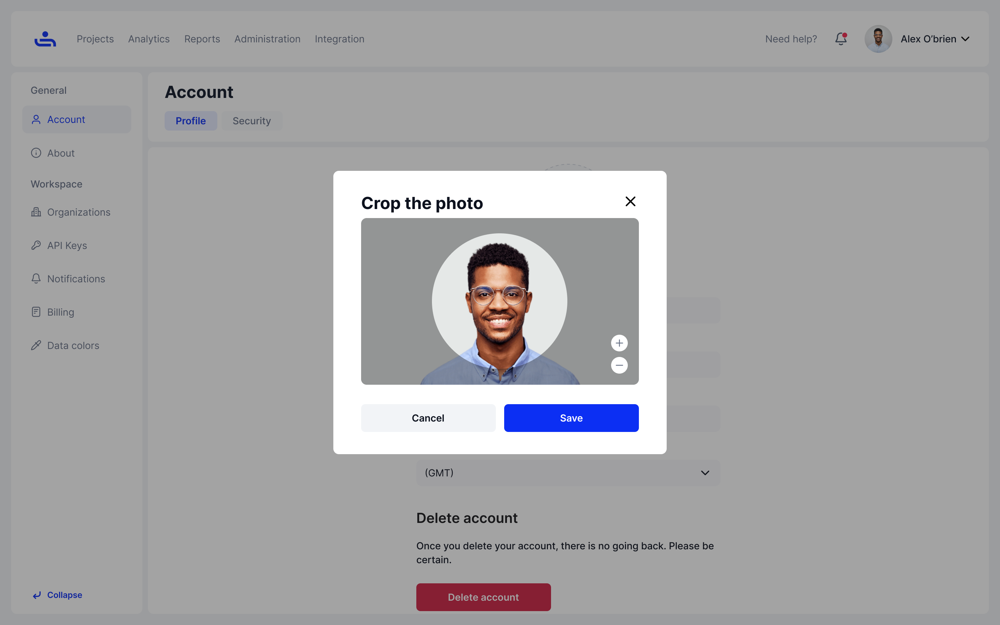
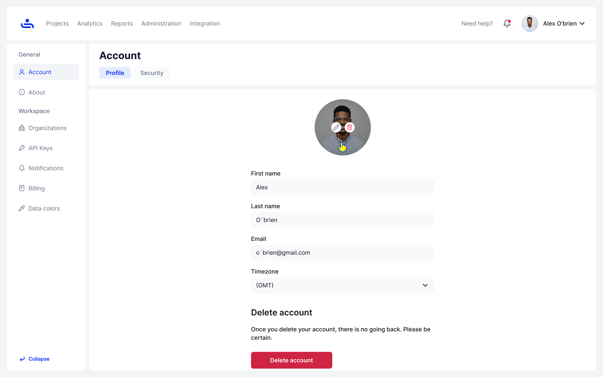

# Account

You profile contains your profile picture, first name, last name, email and allows you to adjust your time zone. You may change any of these fields and save them by clicking "Update settings" on the bottom right of the screen.&#x20;

<figure><figcaption></figcaption></figure>

You may also change your profile picture by clicking "Browse files," choosing an image (you can drag and drop an image instead), cropping it to fit and clicking "save"

<figure><figcaption></figcaption></figure>

<figure><figcaption></figcaption></figure>

The profile page also provides the option to delete your TestFiesta account. We will show you how to delete your account on the next page.&#x20;
