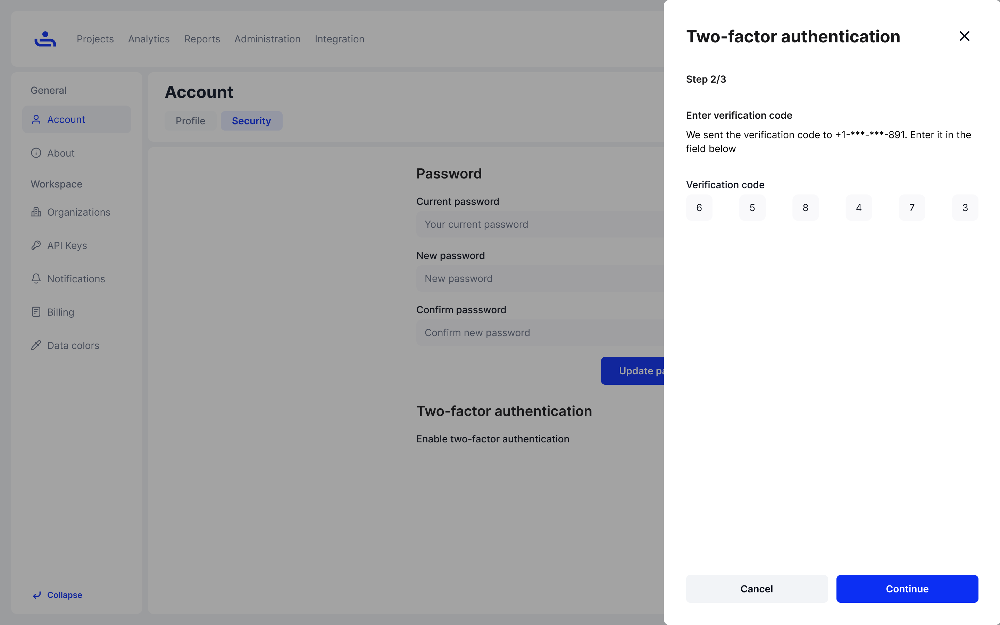

# Two-Factor Authentication (2FA)

This page will show you how to use both methods to secure your account.

## Phone Number

Step 1: Enter your phone number

Enter the phone number for the mobile device you intend to use for TestFiesta and press "Continue." This will send a six-digit verification code to the phone number provided.&#x20;

<figure><figcaption></figcaption></figure>

Step 2: Enter the verification code

Once you receive your unique six-digit verification code, enter the code into the field provided on the webpage and click "Continue."&#x20;

<figure><figcaption></figcaption></figure>

Step 3: Record your unique recovery codes

You will receive six unique recovery codes that allows you still access TestFiesta if you cannot access authentication codes. Note, you will not be able to retrieve the recovery codes after completing the two-factor authentication set up process.

<figure><figcaption></figcaption></figure>

## Google Authenticator App

Step 1: Scan the QR code

Open your Google Authenticator app and scan the provided QR code with it. A six-digit verification code will appear.

<figure><figcaption></figcaption></figure>

Step 2: Enter the verfication code

Type the six-digit verification code into the field provided and press "Continue"

<figure><figcaption></figcaption></figure>

Step 3: Record your unique recovery codes 

You will receive six unique recovery codes that allows you still access TestFiesta if you cannot access authentication codes. Note, you will not be able to retrieve the recovery codes after completing the two-factor authentication set up process.

<figure><figcaption></figcaption></figure>

Two-factor authentication is now set up for your account and will be required for you to log in, unless it is disabled. To see how to disable 2FA click "Next"&#x20;
