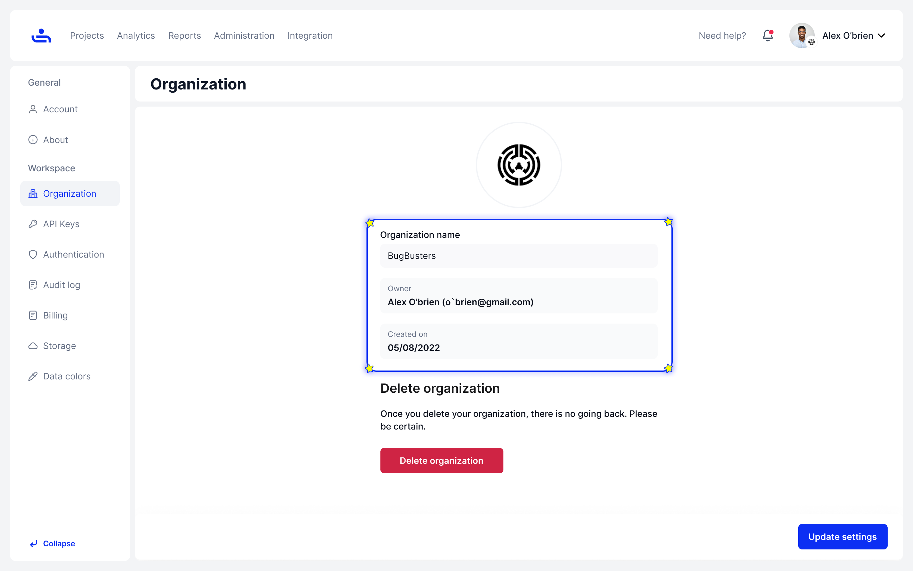
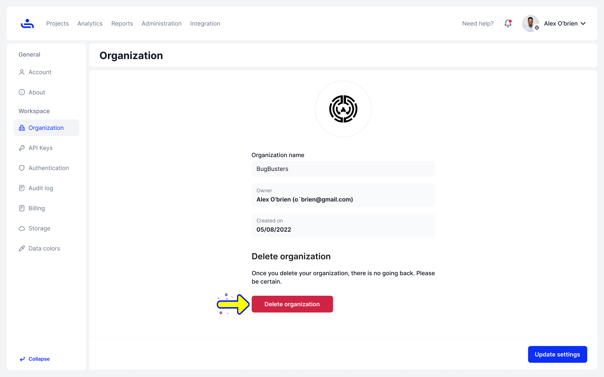

# Organization Owner Workspace

To get to your Organization Owner Settings, click the dropdown menu beside your name and choose the account with the Organization name you want to change the settings for. Click "Settings" once on the right account and you should see the page below.&#x20;

<figure><figcaption></figcaption></figure>

The home page shows your Organization name, the owner, and when the Organization was created.&#x20;

<figure><figcaption></figcaption></figure>

You may also delete your Organization on this page. To do so, click the red "Delete Organization" button. This will bring up a confirmation menu.&#x20;

<figure><figcaption></figcaption></figure>

Enter your password and click "Delete." &#x20;

<figure><figcaption></figcaption></figure>


All data from your Organization will be lost upon deletion.&#x20;


If you chose not to delete your Organization, we have a few more settings we would like to explain. Click "Next" to learn about Organization API Keys/&#x20;
