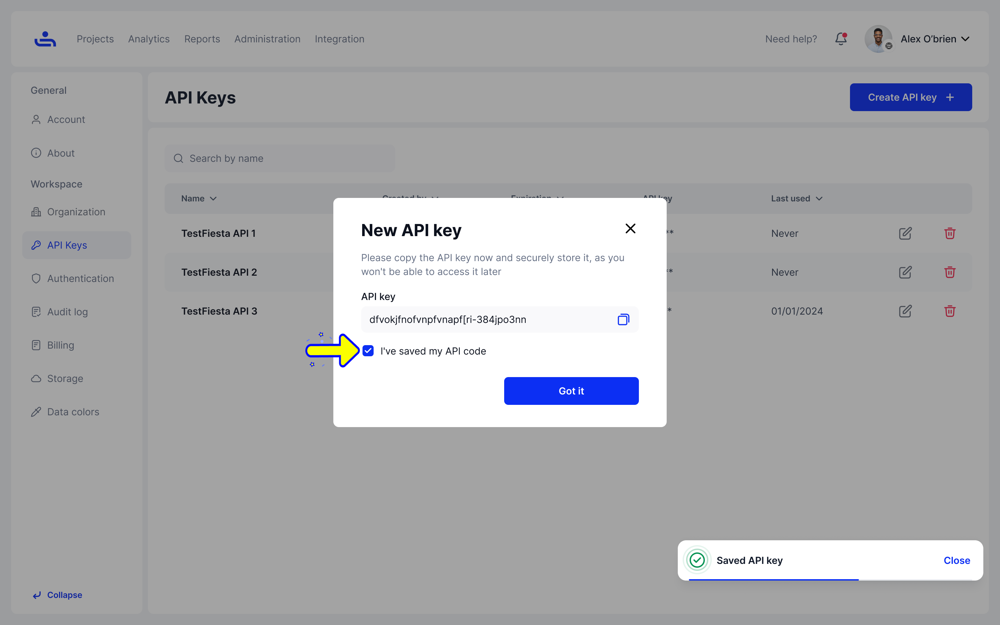

# Creating API Keys

Step 1: Click "Create API key" in API Keys tab

On the API Keys tab, click the "Create API key" button, which can be found on the top right side of the screen. This will open the "Create API Key" menu

<figure><figcaption></figcaption></figure>

Step 2: Name API key and set Expiration 

You can name your API key and set its expiration date. Optionally you can set the API Key to have no expiration. Both the name and expiration date can be changed later.&#x20;

<figure><figcaption></figcaption></figure>

Step 3: Click "Generate API key" 

This will bring up the "New API Key" menu

<figure><figcaption></figcaption></figure>

Step 4: Record your generated API key

Securely store your API key either on your computer or by hand.&#x20;


Once you leave this menu, you will not be able to access this API key again.


Step 5: Click "I've saved my API code" checkbox and then click "Got it" 

Once you have securely stored your API key, confirm you have done so by clicking "I've saved my API code" and then close the menu by clicking "Got it"&#x20;

<figure><figcaption></figcaption></figure>

You now know how to create API Keys! The next sub-tab in your Organization settings is Authentication. There you will be able to set your Organization password policy, Two-Factor Authentication, and more. Click "Next" to begin learning. &#x20;
