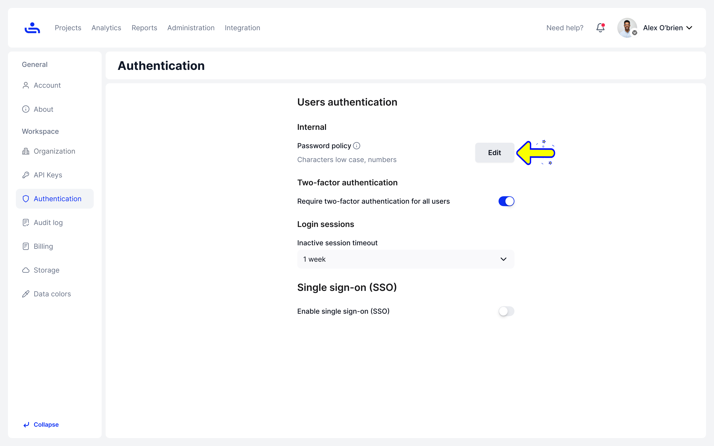
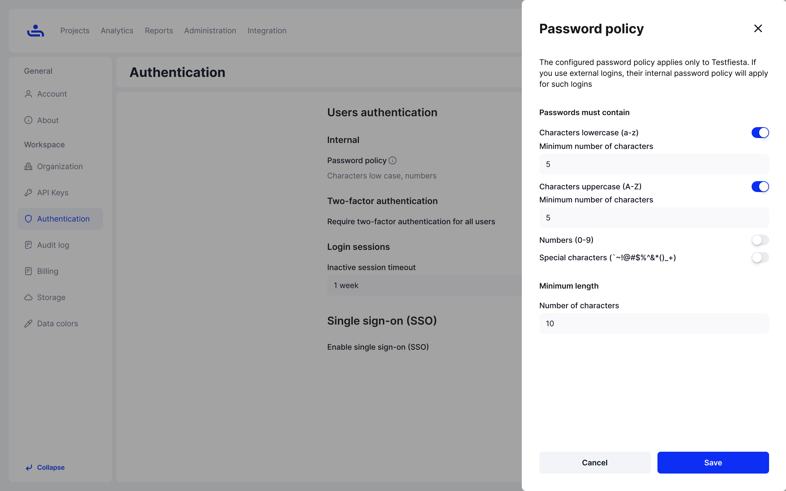

# Password policy

Step 1: Click "Edit" Password Policy

On the Authentication tab of your Organization settings, click the "Edit" button to the right of your Password Policy. This will bring out the "Password Policy" sidebar menu

<figure><figcaption></figcaption></figure>

Step 2: Set the rules for your Password Policy

On the Password Policy sidebar menu you can require users to use lowercase, uppercase, and number characters in their passwords. You can also set a minimum number of lowercase, uppercase, and number characters users are required to use in their password. Finally you can set a minimum overall character length.&#x20;

<figure><figcaption></figcaption></figure>

Step 3: Click "Save" 

Your password policy will be saved. You will have a chance to undo your change by clicking "Undo" on the bottom right of the screen.&#x20;

<figure><figcaption></figcaption></figure>

On the next page you will learn more about two-factor authentication and how to make it a requirement for your Organization users. Click "Next" to continue.&#x20;
