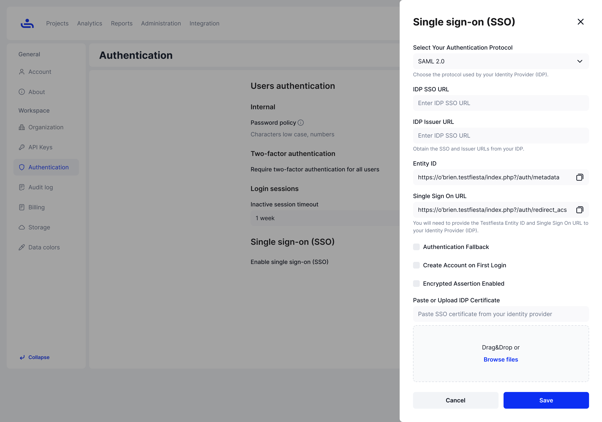
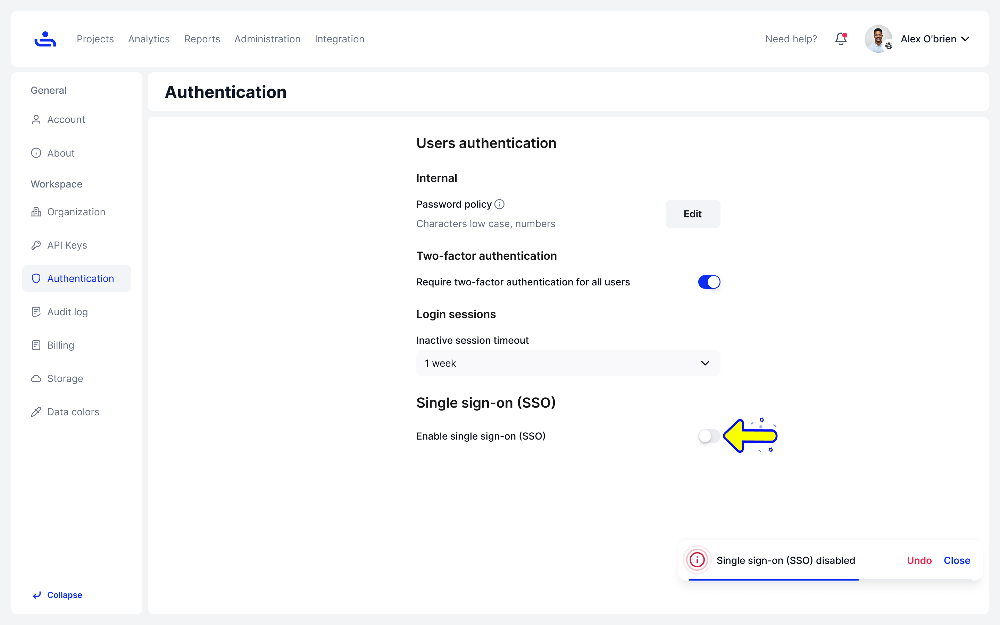

# Single sign-on (SSO)

## Enable SSO

Step 1: Enable Single sign-on

On the Authentication tab of your Organization settings, enable the Single sign-on slider. This will open a Single sign-on sidebar menu

<figure><figcaption></figcaption></figure>

Step 2: Enter your identity provider information.

You identity provider should give you the information to fill all fields required, depending on which provider and authentication protocol you use.&#x20;

<figure><figcaption></figcaption></figure>

You may use three authentication protocols for TestFiesta Single sign-on. SAML 2.0, 0Auth 2.0, and OpenID Connect. Click [here](authentication-protocols.md) to learn how to set up each one with TestFiesta &#x20;

Step 3:  Click "Save" 

Once all required fields are filled out, click "Save." Single sign-on should be enabled and you can use it the next time you log on. &#x20;

<figure><figcaption></figcaption></figure>

## Disable SSO

To disable Single sign-on you can click the "Enable single sign-on" slider to the off position.  A toaster popup will allow you to undo your decision, or you can simply click the slider again to re-enable

<figure><figcaption></figcaption></figure>

## Edit SSO

Step 1: Click "Edit"

When SSO is enabled, an "Edit" button will appear beside the "Enable single sign-on slider. Click the button and the Edit Single sign-on sidebar menu will appear.&#x20;

Step 2: Make changes

Make any changes to your single sign-on settings required.&#x20;

Step 3: Click "Save" 

Once you are done making changes, click "Save" and your changes will be applied.&#x20;

Now that you know the basics of setting up Single sign-on, we will dive deeper into each authentication protocol. Click "Next"&#x20;
