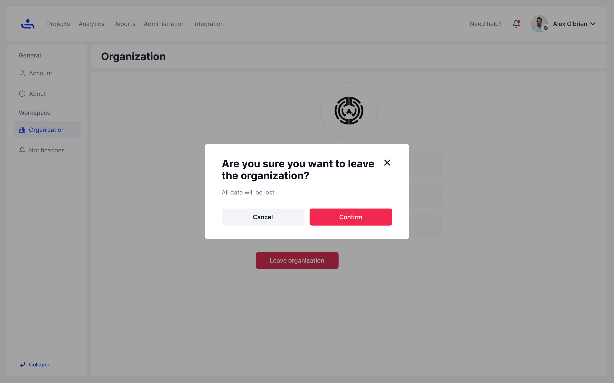

# Leaving an Organization

Step 1: Navigate to Organization settings

From the&#x20;

<figure><figcaption></figcaption></figure>

Step 2: Click "Leave Organization" 

Once you click "Leave Organization" you will be asked to confirm your choice. Click "Confirm" and you will be removed from the Organization

<figure><figcaption></figcaption></figure>

If you want to stay in your Organization, you can also adjust your TestFiesta Notifications for that Organization. The next page will show you how. Click "Next"&#x20;
