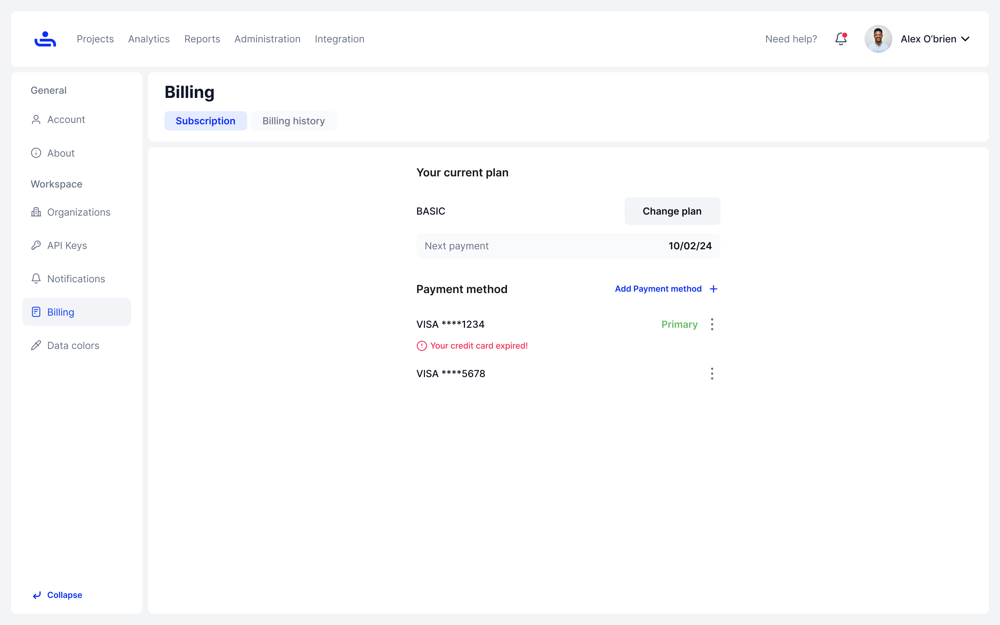
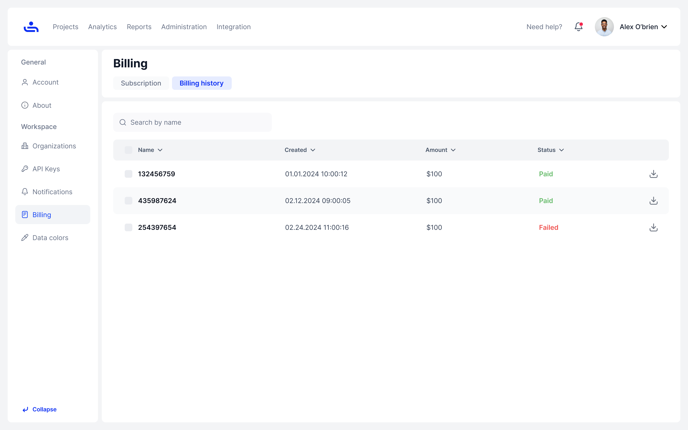

# Billing

## Subscription&#x20;

The subscription sub-tab displays your current TestFiesta plan with the option to change your plan, your next payment date (if applicable), and all your added payment methods.&#x20;

<figure><figcaption></figcaption></figure>

## Billing History

You can view your bill history by clicking on the Billing History sub-tab. This tab contains all bills TestFiesta has sent to you, the date they were created, the amount, and the status of the bill.

&#x20;You can download your bills at any time using the download button on the right side of every bill.&#x20;

<figure><figcaption></figcaption></figure>

TestFiesta has two plans to choose from. Basic and Advanced. In the next page, we will explain the difference between the two plans. Click "Next."&#x20;
