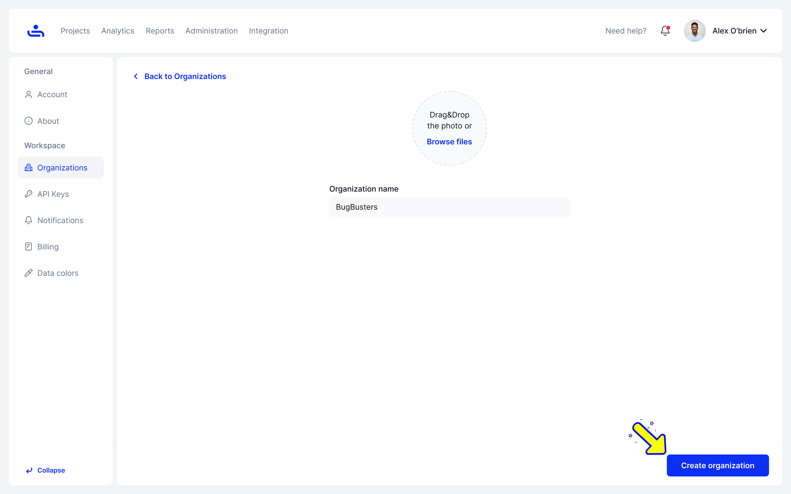

# Creating an Organization

Step 1: Go to the Organization tab in Settings

The Organizations tab can be found on the left side of the settings screen.

<figure><figcaption></figcaption></figure>

Step 2: Click "Create Organization" 

This will take you to another page where you can fill in information for your new Organization.&#x20;

<figure><figcaption></figcaption></figure>

Step 2: Pick the name for your Organization

Here you will pick your Organization name and optionally upload a photo to represent it.&#x20;

<figure><figcaption></figcaption></figure>

Step 3: Click "Create Organization" 

Click the "Create Organization" button at the bottom right of the page.&#x20;

<figure><figcaption></figcaption></figure>

<figure><figcaption></figcaption></figure>

Your organization has been created! Now you can invite your team-mates and begin collaborating.&#x20;

If you need to change your Organization information, you can Edit in a couple easy steps. Click "Next" to see how. &#x20;
