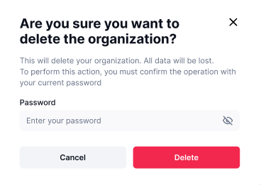

# Deleting an Organization

Step 1: Click the "Edit" button

Click the "Edit" button for the Organization you want to delete. This will take you to the Organization information page.&#x20;

<figure><figcaption></figcaption></figure>

Step 2: Click "Delete Organization" 

Click the red "Delete Organization" button at the bottom. This will pop up a confirmation page.&#x20;

<figure><figcaption></figcaption></figure>

Step 4: Enter your password

You must enter your password to confirm you want to delete your Organization.&#x20;

<figure><figcaption></figcaption></figure>

Step 5: Click "Delete" 

Clicking "Delete" will permanently delete your Organization.&#x20;


Deleted Organizations cannot be recovered after they are deleted.&#x20;

