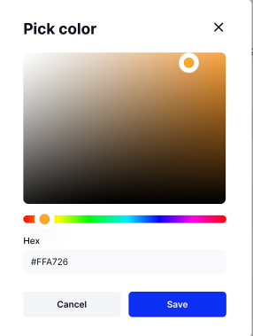

# Data colors

Your Test Case status can be Active, Passed, Incomplete, or Failed and are represented by the colors blue, green, yellow, and red respectively. Test Runs and Defects similarly have colors representing their status as shown in the image Below. &#x20;

<figure><figcaption></figcaption></figure>

You can change the color for each status by clicking on the current color. A "Pick color" menu will appear and you may pick a new color using the color slider and chart. For this example we will change the Test Case "Active" status color and the Defects "New" status color.&#x20;

<figure><figcaption></figcaption></figure>

Once you are done picking a new color, click "Save" and the new status color should appear. If you want to reverse the change back tot he original color, you can click "Restore default" beside your changed color. &#x20;

<figure><figcaption></figcaption></figure>

The last tab in your personal settings will tell you a bit about TestFiesta and provides contact information for our support team. Let's have a look on the next page. Click "Next"&#x20;
