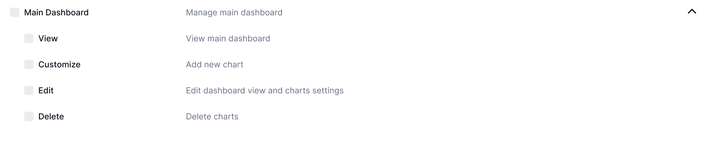
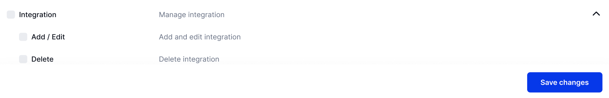

# Create New Roles

<figure><figcaption></figcaption></figure>

On the "Create New Role" page, you can name the role by entering a unique role name, write a description to define its purpose, and assign specific permissions to outline the role’s functions and access levels.

<figure><figcaption></figcaption></figure>

Step 1: Set up <strong>Projects permissions</strong> 

This permissions allow us to manage, view, create, and edit projects, control user access, close projects to prevent further changes, archive or restore them, and delete projects when needed.

<figure><figcaption></figcaption></figure>

Step 2: Set up Milestones permissions

This permissions allow us to manage, view, create, and edit milestones. You can also close, block, or delete milestones as needed.

<figure><figcaption></figcaption></figure>

Step 3: Set up <strong>Dashboard permissions</strong>

This permissions allow us to manage and view milestones, customize the dashboard with new or deleted charts, and adjust chart settings.

<figure><figcaption></figcaption></figure>

Step 4: Set up Test cases permissions

This permission allows us to view, create, edit, change positions, add comments, import, export, and remove test cases. Additionally, it includes permissions to create, edit, change positions, and delete test folders.

<figure><figcaption></figcaption></figure>

Step 5: Set up Test runs permissions

This permission allows us to manage test runs, view existing test runs, create and edit test runs, start test runs and update their statuses, and delete test runs from the system.

<figure><figcaption></figcaption></figure>

Step 6: Set up Test plans permissions

This permission allows us to manage test plans, view existing test plans, create and edit test plans, start test plans and update their statuses, and delete test runs from the system.

<figure><figcaption></figcaption></figure>

Step 7: Set up Defects permissions

This permission allows users to manage defects, create and edit defect records, and delete defects from the system.

<figure><figcaption></figcaption></figure>

Step 8: Set up Main dashboard permissions

This permission allows us to manage the main dashboard, view the dashboard, add new charts, edit dashboard views and chart settings, and delete charts.

<figure><figcaption></figcaption></figure>

Step 9: Set up Reposts permissions

This permission allows us to manage reports, view reports, create/edit public reports, export reports, and delete reports.

<figure><figcaption></figcaption></figure>

Step 10: Set up Users permissions

This permission allows us to manage and add new users, invite users (pending administrator approval), and delete users.

<figure><figcaption></figcaption></figure>

Step 11: Set up Roles permissions

This permission allows us to manage and edit roles, assign users to various roles (including account admin, project admin, QA lead, tester, client, and billing roles), set roles by project, and delete roles.

<figure><figcaption></figcaption></figure>

Step 12: Set up Tags permissions

This permission allows us to manage and edit tags, move them to and from the archive (where they remain hidden), and delete tags.

<figure><figcaption></figcaption></figure>

Step 13: Set up Custom fields permissions

This permission allows us to manage and edit custom fields, utilize fields created by others in their test designs, and delete custom fields.

<figure><figcaption></figcaption></figure>

Step 14: Set up Shared steps permissions

This permission allows us to manage, create, and edit shared steps, move them to and from the archive, use shared steps created by others, and delete shared steps.

<figure><figcaption></figcaption></figure>

Step 15: Set up Repository permissions

This permission allows us to manage the repository, including adding, editing, importing, exporting, and deleting test cases and test folders. It also enables organizing test cases within folders and handling test folder operations.

<figure><figcaption></figcaption></figure>

Step 16: Set up Billing role permissions

This permission manages billing information, including full access to subscription details and payment history, with options to modify billing settings and payment methods or restrict access accordingly.

<figure><figcaption></figcaption></figure>

Step 17: Set up Integration permissions

This permission allows us to manage integrations, including adding, editing, and deleting integration settings.

<figure><figcaption></figcaption></figure>


Set up the permissions according to your requirements. Once you've made your selections, click the "Save changes" button below the list to apply the changes.


You have now created a new Role! The following section will focus on Tags that you can assign to sort and search items easier. Click "Next" to begin.&#x20;
