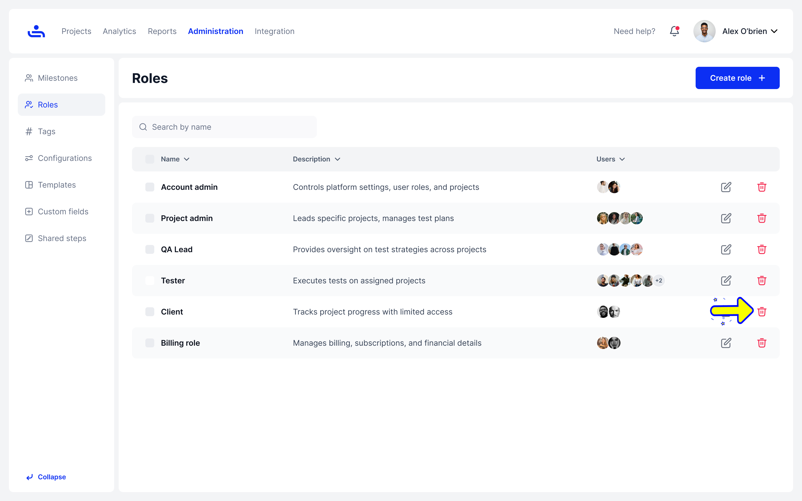
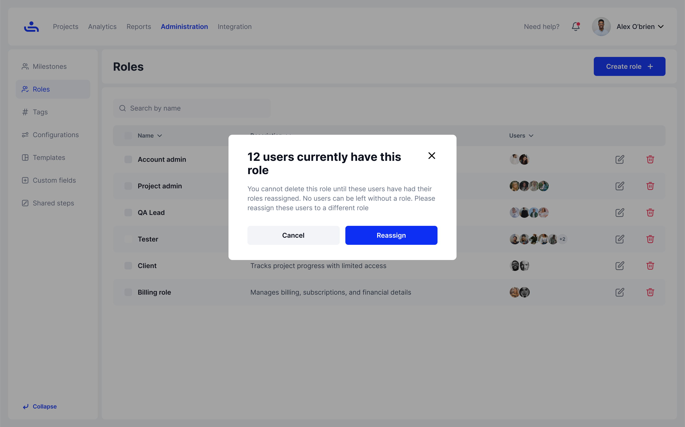
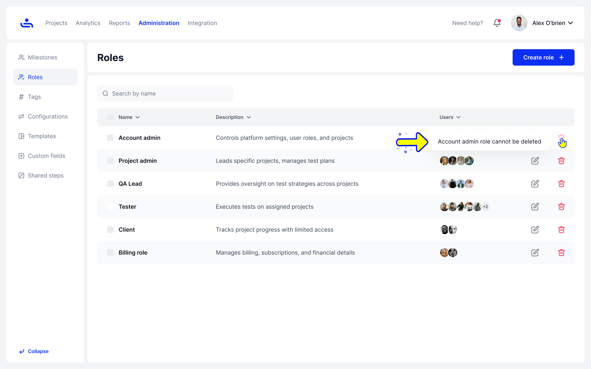
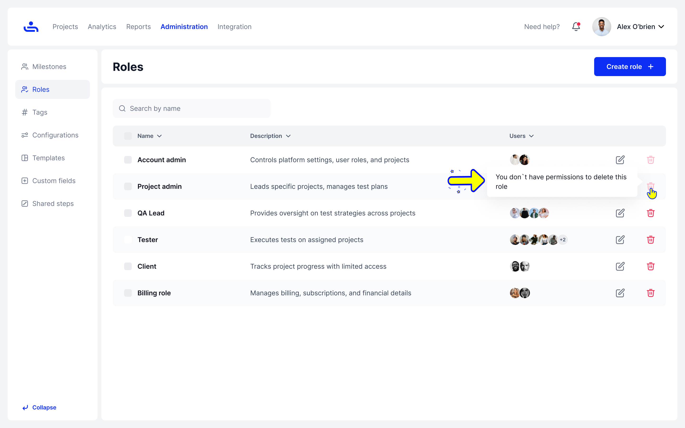

# Deletе Roles

Step 1: Click on Delete button

Click on the Trash icon to remove the selected role and all associated users from the system

<figure><figcaption></figcaption></figure>


Reassign Users Before Deleting a Role. To delete a role, first ensure that all users assigned to this role are reassigned to a different role. You cannot delete a role if there are users currently assigned to it.


<figure><figcaption></figcaption></figure>


The Account Admin role cannot be deleted. The Account Admin role cannot be deleted as it is crucial for system management. To adjust settings, modify the role's permissions instead.


<figure><figcaption></figcaption></figure>


You must have the appropriate permissions to delete roles. If you cannot delete a role, check your permissions or contact an admin for assistance.


<figure><figcaption></figcaption></figure>

You can create a new Role to fit the needs of your Organization. Click "Next" to see a step-by-step guide on creating new Roles.
