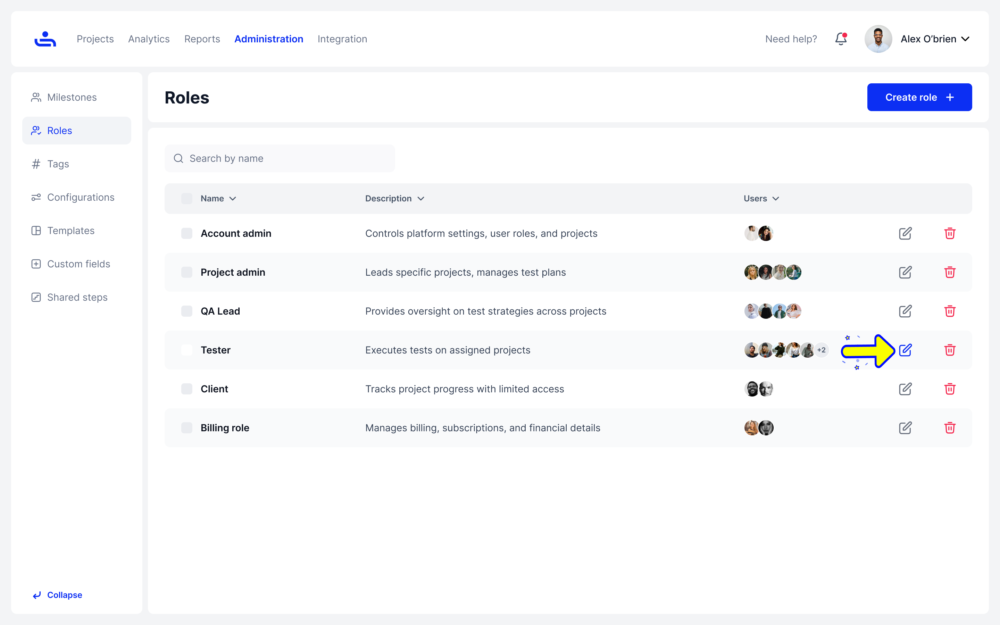

# Edit Permissions

Step 1: Click the Edit Permission button 

Click the pencil icon to open the Edit Permissions interface for that role of user

<figure><figcaption></figcaption></figure>

Step 2: Modify Role Details

On this page, you can change the role's name, update its description, and customize its permissions

<figure><figcaption></figcaption></figure>

If you no longer need a Role in your Organization, then you can delete it. Click "Next" to see the steps.&#x20;
