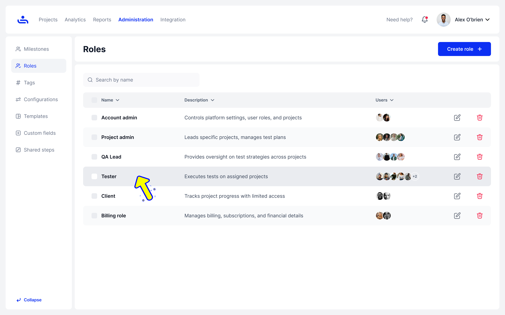
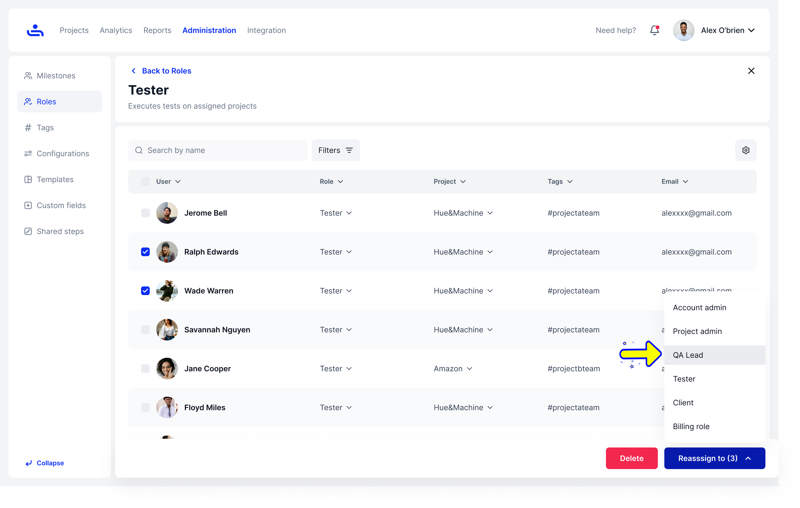
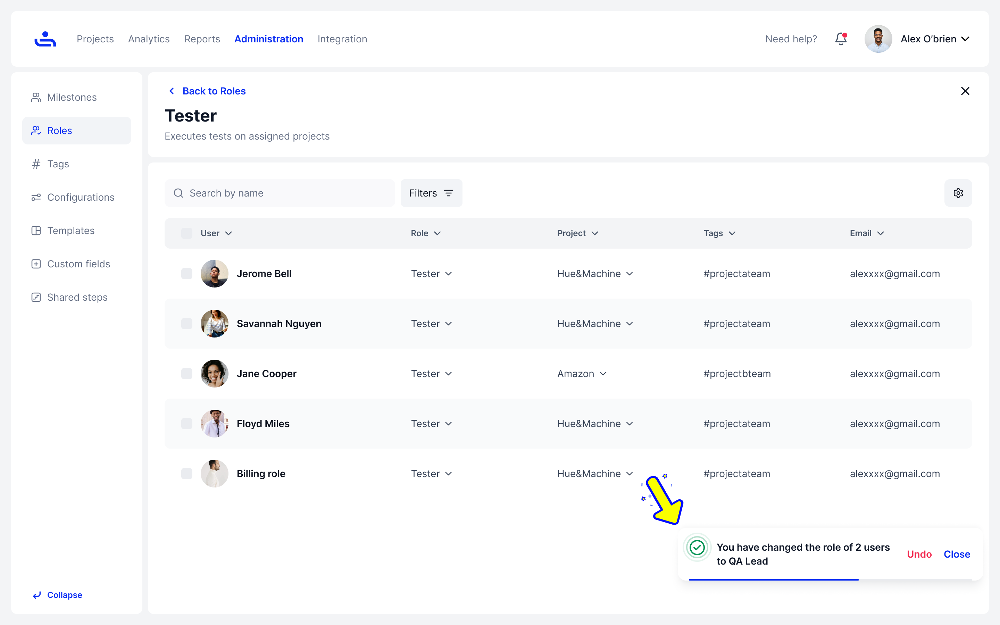

# Reassign Role

Step 1: View Users by Role

On the dashboard, click on the specific roles group to open the page displaying users assigned to each role

<figure><figcaption></figcaption></figure>

Step 2: Manage Selected Users

After selecting users with the checkboxes, use the **Delete** button to remove their roles or the **Reassign** button to assign new roles.  Note that users who are reassigned will disappear from this list but will appear in the list of users with their new roles.

<figure><figcaption></figcaption></figure>

You have successfully changed the role of 2 users to QA Lead. Great job!

<figure><figcaption></figcaption></figure>

You can also change the permissions for an existing role at any time. Click "Next" to learn how.
