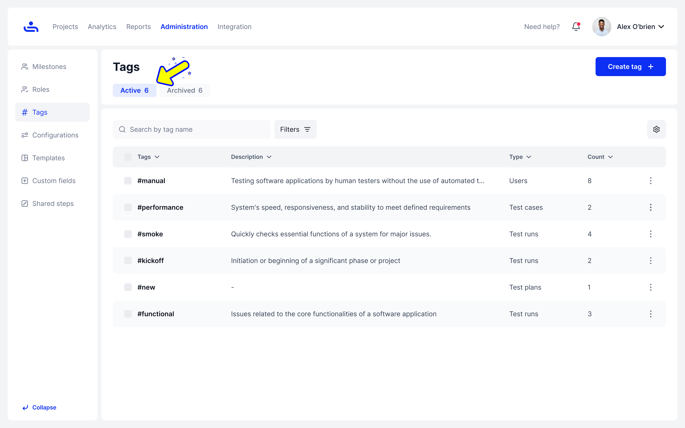

# Active and Archived Tags

Tags can have Active and Archived status.&#x20;

Active Tags.

Active Tags are currently in use, and you can view all their details, including name, description, type, and usage count (how many times they have been used).

<figure><figcaption></figcaption></figure>

Archived tags.

Archived tags are those that have not been deleted but have been set to archived by the user.

<figure><figcaption></figcaption></figure>

Now that you understand what an Archived Tag is, we'll show you how to Archive, Unarchive, and Delete a Tag. Click "Next" to learn more.
