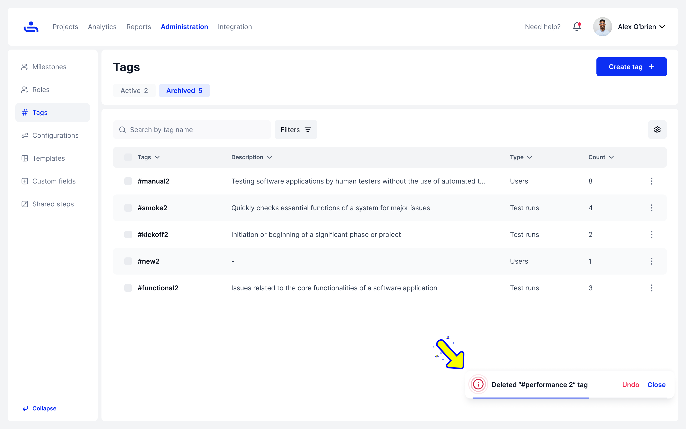

# Delete, Archive and Unarchive Tags

### Don't need a tag anymore? You can delete it

Go to Administration -> Tags.

Click the kebab button and select “Delete” next to the tag you no longer need.

<figure><figcaption></figcaption></figure>


Wait! Deleting the tag is permanent and cannot be undone. Please think twice before proceeding.


<figure><figcaption>
A popup will appear, giving you the option to either archive or delete the tag.
</figcaption></figure> <figure><figcaption>
A notification will appear, allowing you to click "Undo."
</figcaption></figure>

### Archive the tag

It will be removed from view, but you can restore it if needed.

<figure><figcaption></figcaption></figure>

<figure><figcaption></figcaption></figure>

You can manage archived tags in the Archived section.

Delete a tag from Archived.

Removing a tag from the archived section will permanently delete it, causing it to disappear from all views.

<figure><figcaption></figcaption></figure>

<figure><figcaption>
A notification will appear when you try to delete a tag.
</figcaption></figure> <figure><figcaption>
A notification will appear, allowing you to click "Undo."
</figcaption></figure>

Unarchive a Tag.

This action will move the tag back to the Active section, making it visible in all relevant views again.

<figure><figcaption></figcaption></figure>

In the upcoming section, you will learn how to create, filter, edit, and delete Organization Templates. Click "Next" to begin learning.&#x20;
