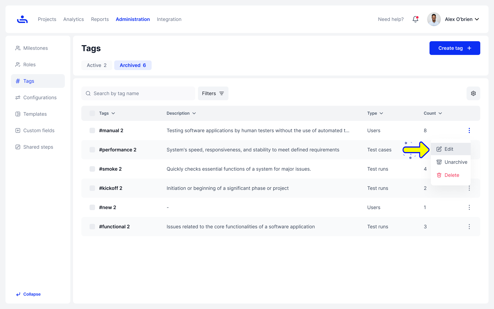
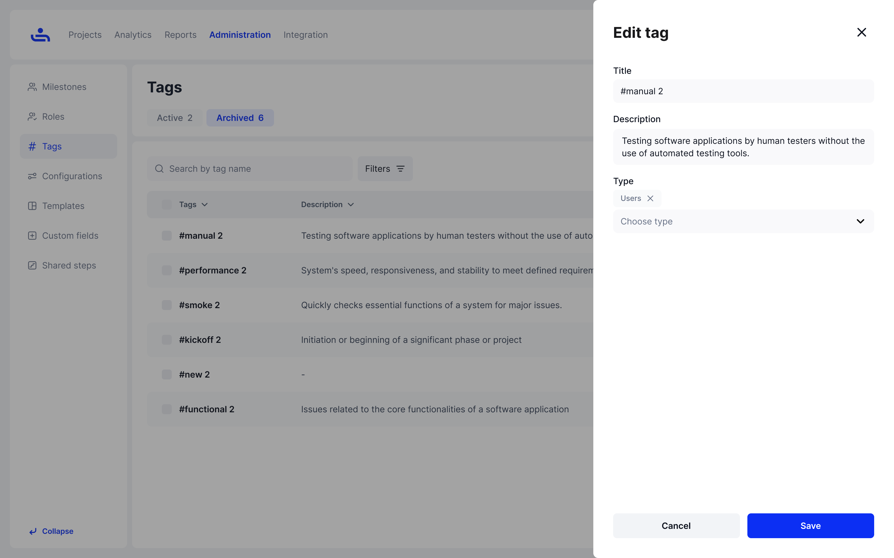

# Editing a Tag

Want to change a tag?&#x20;

Step 1: Go to Administration -> Tags.

Here is the list of all your tags.

Step 2: Click “Edit.” 

Click on the kebab icon and choose the "Edit" option. A window will appear on the right side, allowing you to change the tag’s information.

<figure><figcaption></figcaption></figure>

Step 3: Make changes according to your new needs.

When you’re finished, click “Save” to see the changes.

<figure><figcaption></figcaption></figure>

Now that you have your Tags, you can search and filter for any specific one that you might need. Click "Next" to see how to search your Tags.&#x20;
