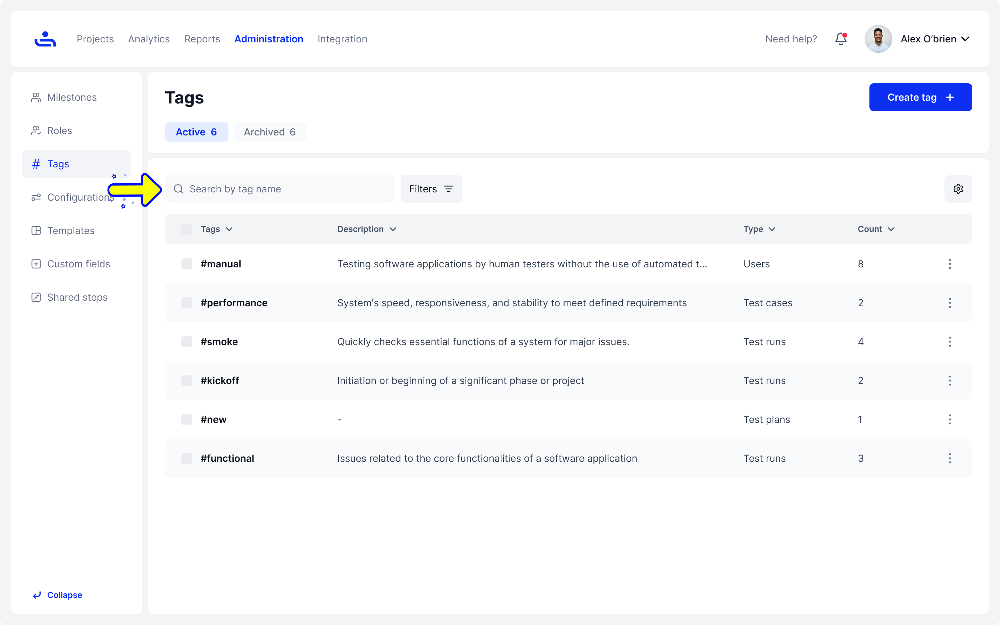
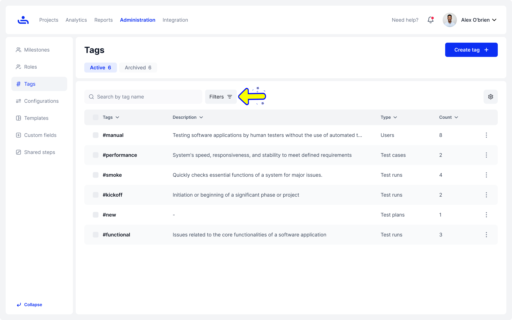

# Tags Search and Filters

### Search

Start typing the tag name to quickly find the tag you need.

<figure><figcaption></figcaption></figure>

### Filters

Click the "Filters" button to open the Filters panel, where you can see a list of tags based on your selected filter settings.

<figure><figcaption>
Click the "Filters" button.
</figcaption></figure>

<figure><figcaption>
Choose the desired options to view a list of tags based on your selected filter settings.
</figcaption></figure>
