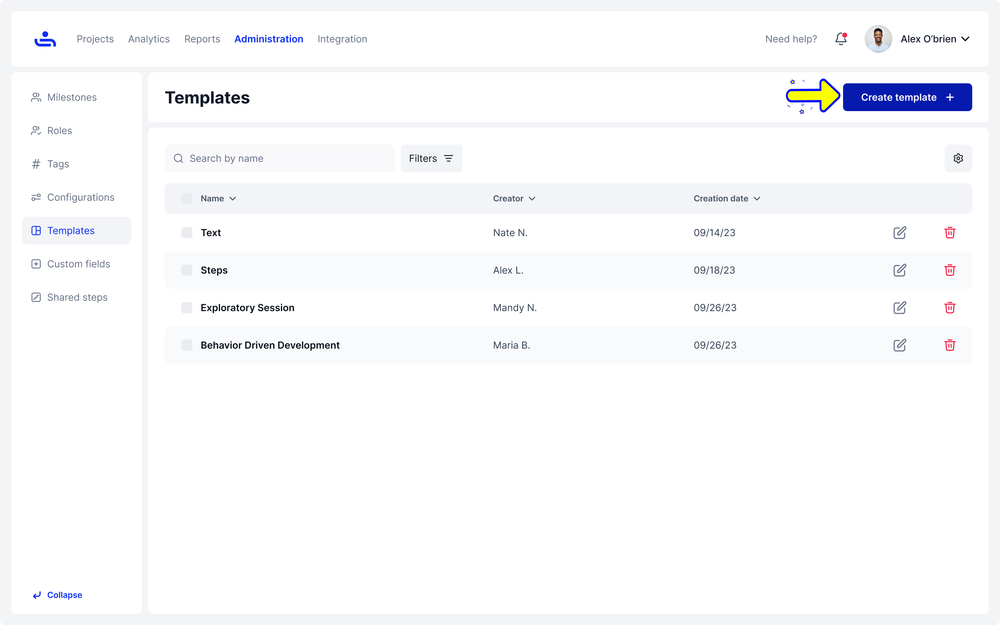

# Create Template

Step 1: Click on the "Create template" button

Clicking "Create Template" opens a window to set the template information.

<figure><figcaption></figcaption></figure>

Step 2: Choose the type of Fields for the Template

Click "Add Field" to include fields in your template. Choose "Add Existing Field" for pre-made options or "Add New Custom Field" to create a new one.

<figure><figcaption></figcaption></figure>

To define and set up custom fields for your template, choose "Add new custom field."

Step 3: Add new custom field

Here you can specify the field's name and select its data type.&#x20;

<figure><figcaption></figcaption></figure>


Clicking the trash icon will delete the custom field from your template.


Step 4: Choose Data type

Choose the data type for your custom field from the following options: Dropdown for a list of choices, Radio Button for single selections, Link for URLs, Text for general input, Check-box for binary choices, Date for selecting dates, Step for stages or instructions, and Attachment for file uploads.

<figure><figcaption></figcaption></figure>

Step 5: Click on the "Create button" to create the template

Click on the "Create" button to finalize and save your new template. This action will generate the template with the specified fields and settings, making it ready for use in your test cases.

<figure><figcaption></figcaption></figure>

You have created your first custom Template! You can now use the Template in any Test Case across your Organization. The are also default Templates you can use instead. Click "Next" to learn more.&#x20;
