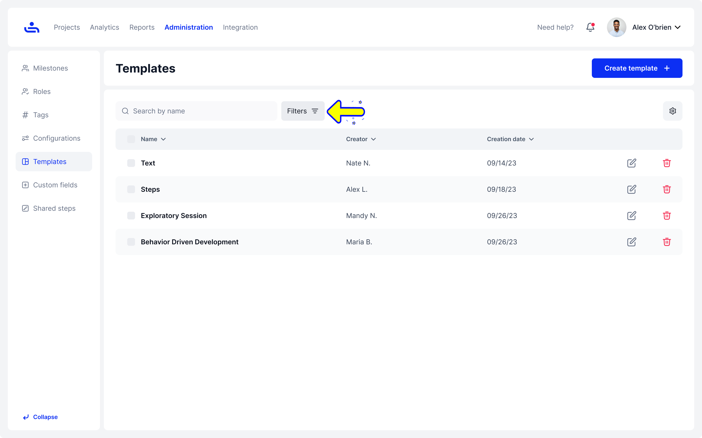
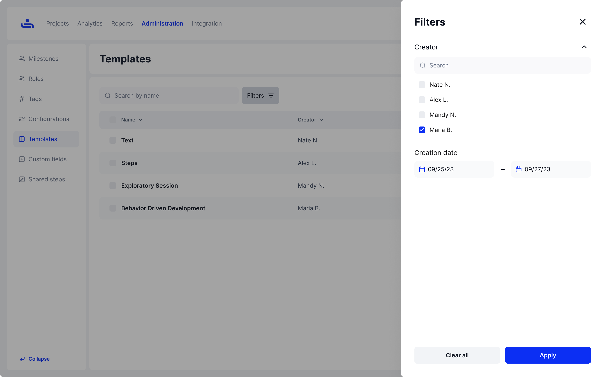
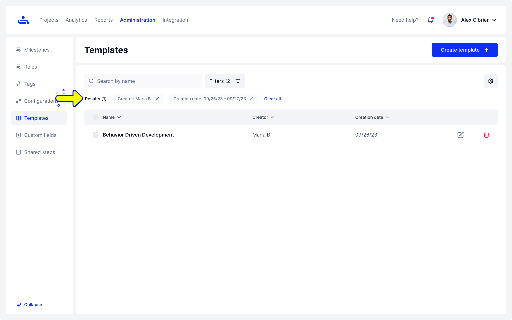

# Filter Template

Step 1: Click the filter button

Locate and click the "Filter" button on the template page

<figure><figcaption></figcaption></figure>

Step 2: Select Filter Options

A window will appear with various filter options. Choose the criteria you want to filter by, such as name, data type, creation date, or data source.

<figure><figcaption></figcaption></figure>

Step 3: View Filtered List

After selecting your filter criteria, the template list will update to display only the items that match your selected filters.

<figure><figcaption></figcaption></figure>

Congratulations! You have successfully filtered the list. Great job!

If you ever need to modify your existing templates, you can easily do so by editing them. On the next page, we’ll show you how to edit templates. Click "Next" to continue.
