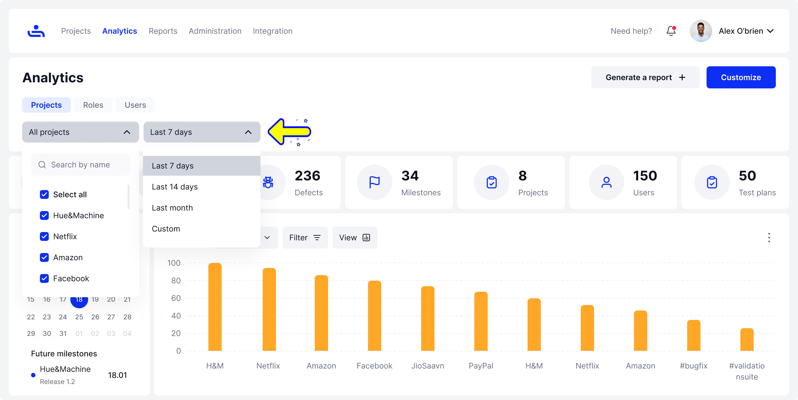
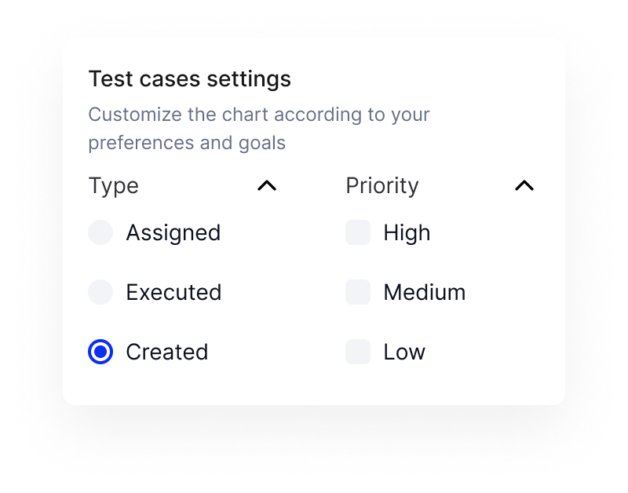
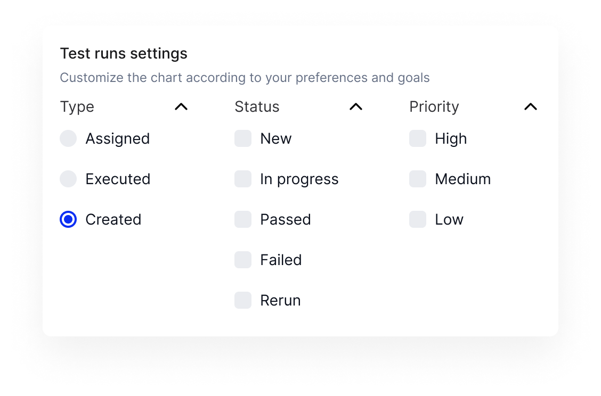

# Chart Filters

## General Filters

<figure><figcaption>
Filters for the Projects view
</figcaption></figure>

<figure><figcaption>
Filters for the Roles view
</figcaption></figure>

<figure><figcaption>
Filters for the Users view
</figcaption></figure>

You can use the general filters to customize the overall view of the Analytics Panel.

## Bar Chart Filters

<figure><figcaption></figcaption></figure>

<figure><figcaption></figcaption></figure>

Bar Chart filters allow you to pick which item to show (Test Cases, Test Runs, Defects), by status, priority, and how the Y axis is viewed. You can also split the total value of each column based on their status or priority as shown below&#x20;

## Overview Chart Filters

<figure><figcaption></figcaption></figure>

<figure><figcaption></figcaption></figure> <figure><figcaption></figcaption></figure> <figure><figcaption></figcaption></figure> <figure><figcaption></figcaption></figure>

Overview chart filters allow you to choose which type, status, or priority to display for each item.&#x20;

## Donut Chart Filters

<figure><figcaption></figcaption></figure> <figure><figcaption></figcaption></figure> <figure><figcaption></figcaption></figure>

You can choose to display different items, split those items based on status, priority and type, then filter for the specific values you want to compare.&#x20;

## Line Chart Filters

<figure><figcaption></figcaption></figure>

<figure><figcaption></figcaption></figure>

<figure><figcaption></figcaption></figure>

Line charts let you display the total number of an item (Test Cases, Test Runs, Defects) over a time frame. You can add lines to this chart by showing the value of an item over time based on it's status or priority.&#x20;

For example, the above chart shows the number of high, medium, and low priority defects over a week

Now you should have a grasp on how to navigate the Analytics tab. Let's move on to Reports. Click "Next"&#x20;
