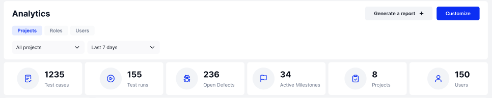
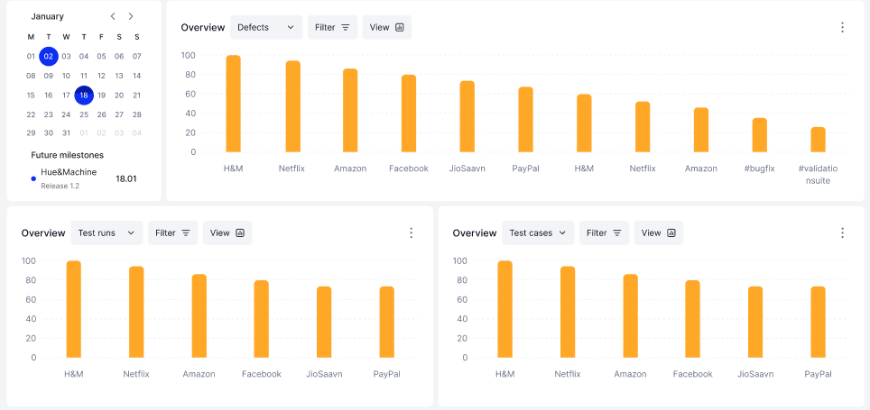
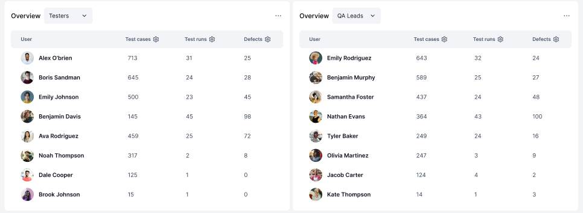

# Projects

We will explain the projects tab, piece by piece, starting with the top. &#x20;

<figure><figcaption></figcaption></figure>

At the top of the tab you will find:&#x20;

* A drop down menu allowing you to pick projects to include in the graph. This example has "Select all" chosen.&#x20;
* Another drop down menu choosing the date range you wish to graph&#x20;
* Number of Test Cases
* Number of Test Runs
* Number of Open Defects
* Number of Active Milestones
* Number of Projects being graphed
* And number of Users &#x20;

Next is the middle of our Projects tab page &#x20;

<figure><figcaption></figcaption></figure>

This area takes the item numbers stated above (Test Runs, Test Cases, Defects) and graphs them by which project they are in. There is also a calendar that will display important upcoming milestones.&#x20;

And the last part of the projects tab shows:&#x20;

<figure><figcaption></figcaption></figure>

A list of users based on their role. Each column will tell you how many Test Cases, Test Runs and Defects the user has been assigned&#x20;

Now that you have a basic idea on the Projects tab, let's have a look at the Roles tab the same way. Click "Next"&#x20;
