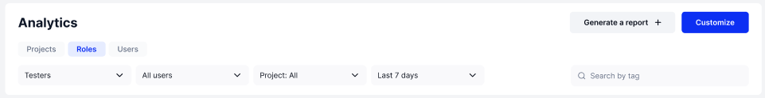
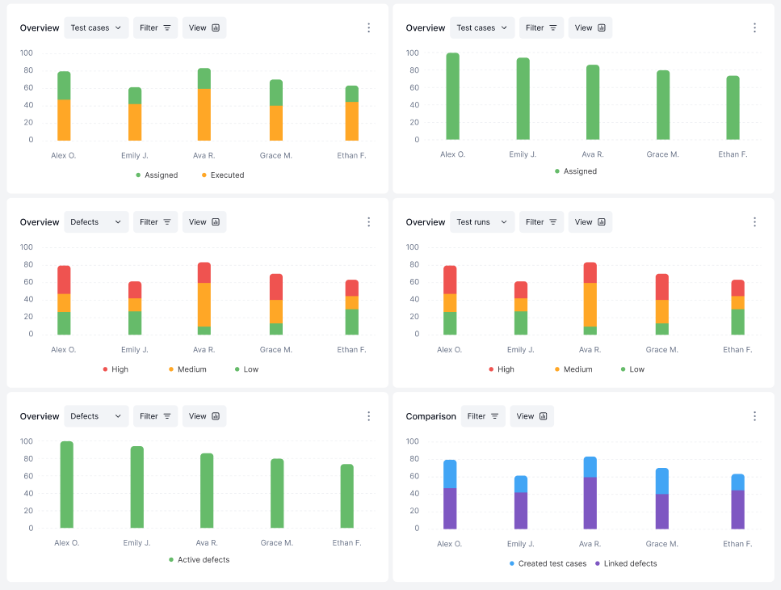

# Roles

Again, just like with the projects tab, we will look at and explain the Roles tab, piece by piece.&#x20;

First with the top section:&#x20;

<figure><figcaption></figcaption></figure>

Here there are drop-down menus to:

* Choose a role to graph
* Pick either all users within your chosen role, or specific users to be graphed
* Pick either all project information to be graphed or specific projects
* Pick the date range of information to be shown

There is also:

* A search bar so you can search for specific tags
* A "Generate a report" button that let's you make a report out of the graphed information to be shared&#x20;
* And a "Customize" button if you wanted to change the type of graphs being shown&#x20;

The bottom section displays multiple graphs in various configurations:&#x20;

<figure><figcaption></figcaption></figure>

In the top right example you can see the number of Test Cases certain users were assigned and to the left is how many Test Cases were assigned and how many were executed by each user.&#x20;

These charts can display many different variables which we will discuss later, but first, we have one more tab to investigate. Click "Next" to learn about the Users tab. &#x20;
