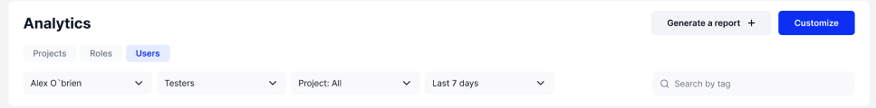
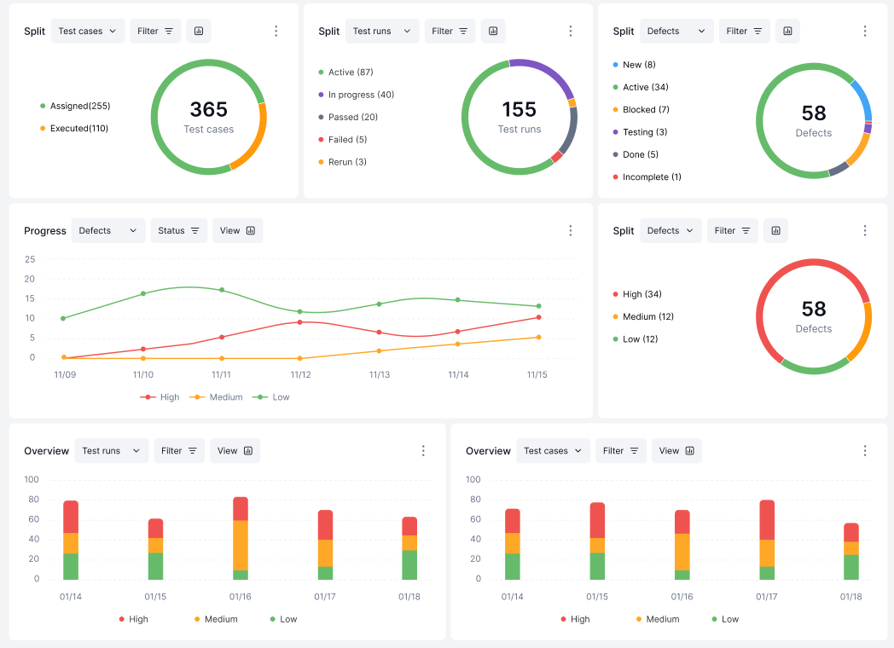

# Users

Let's break up the Users Tab like we have done with the Project and Roles tabs&#x20;

The top section

<figure><figcaption></figcaption></figure>

Here there are drop-down menus to

* Choose a User to graph
* Pick a role and populate the first dropdown menu with all users with said role
* Pick either all project information to be graphed or specific projects the chosen user has worked on
* Pick the date range of information to be shown

There is also:

* A search bar so you can search for specific tags
* A "Generate a report" button that let's you make a report out of the graphed information to be shared&#x20;
* And a "Customize" button if you wanted to change the type of graphs being shown&#x20;

The bottom section:&#x20;

<figure><figcaption></figcaption></figure>

These charts show the current work load and progress of a user.

The middle left graph, for example, tells us the amount of high, medium, and low priority defects this User has over the course of a week. As they are cleared or he is assigned more defects, the lines will swerve up or down to show how his work is progressing. Managers can use this to keep track of user productivity.&#x20;

We have now given a overview of each tab. Next we will look closer at each available graph. Click "Next"
