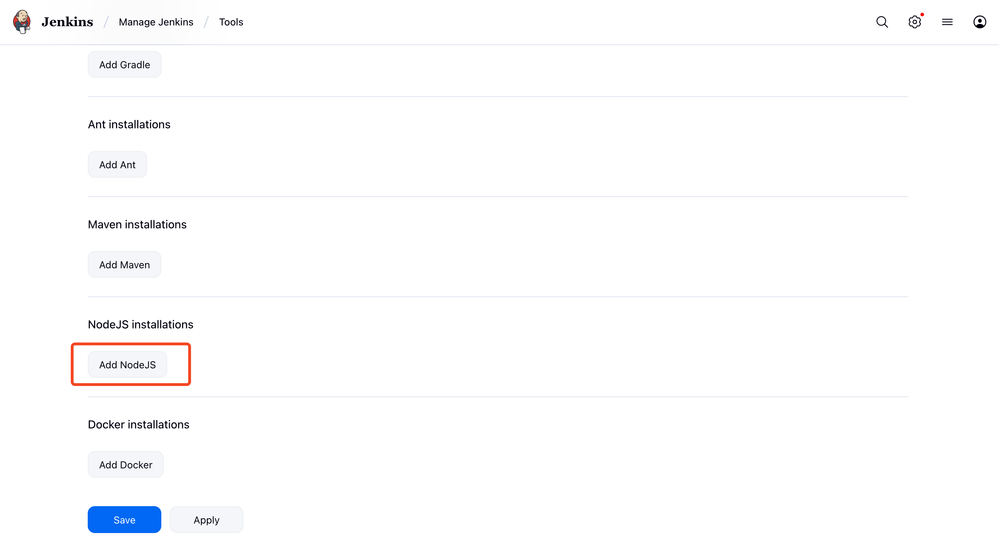

# Jenkins (Freestyle)

<figure><figcaption></figcaption></figure>

Jenkins is the leading open source automation server, Jenkins provides hundreds of plugins to support building, deploying and automating any project.

You can use our [jenkins](https://plugins.jenkins.io/tacotruck-plugin) plugin in your free-style project. You can setup jenkins from their official [docs](https://www.jenkins.io/doc/book/installing/) or follow our [jenkins-pipeline.md](jenkins-pipeline.md "mention") guide.

### Install Tacotruck plugin

Go to the "Available Plugins" section on the settings page and search for "Tacotruck" to install.

<figure><figcaption></figcaption></figure>

### Install Node.js Plugin

Tacotruck plugin requires `nodejs` as dependency. Login to your jenkins dasboard and go to the settings page. Plugins are available at [http://localhost:8080/manage/pluginManager/available](http://localhost:8080/manage/pluginManager/available) this path. You can search for "Nodejs" plugin. Select the plugin and install. You may need to restart your jenkins instance after installing the nodejs plugin.

<figure><figcaption></figcaption></figure>

### Configure Nodejs as Global Tool

1. Go to settings and click on tools section.

<figure><figcaption></figcaption></figure>

2. Click on "Add Nodejs" button

<figure><figcaption></figcaption></figure>

3. Install a Nodejs version. Please make sure that you install node **version** ≥ <mark style="color:red;">`20`</mark>. You need to name the Tool so that we can refer it later from the pipeline script.

<figure><figcaption></figcaption></figure>

### Create a Freestyle project

Click on the "New Item" button from the home page of jenkins dashboard and create a new freestyle project.

<figure><figcaption></figcaption></figure>

### Configure your project

First we need to configure `nodejs` environment for Tacotruck CLI. We can select the "Environment" tab and under "Envronment" section we should select the option to `Provide Node & npm bin/ folder to PATH`&#x20;

<figure><figcaption></figcaption></figure>

### Add Build and Test step

You can configure build and test step based on your tech stack or requirements. Here is an example that runs a C# .NET test and outputs a `test-results.xml`  file.

<figure><figcaption></figcaption></figure>

### Submit the test results using Tacotruck step

We can add "Execute Tacotruck" build step from "Add build step" dropdown button and configure all the required fields.

<figure><figcaption></figcaption></figure>

<figure><figcaption></figcaption></figure>

### Support and Resources

* [TacoTruck Examples](https://github.com/testfiesta/tacotruck-examples)
* [Jenkins Plugin](https://plugins.jenkins.io/tacotruck)
* [Jenkins Plugin Source](https://github.com/jenkinsci/tacotruck-plugin)
* [Tacotruck Issues](https://github.com/testfiesta/tacotruck/issues)
* [**CLI Reference**](../tacotruck-cli/)
* [Tacotruck Github Action](https://github.com/testfiesta/tacotruck-action)
