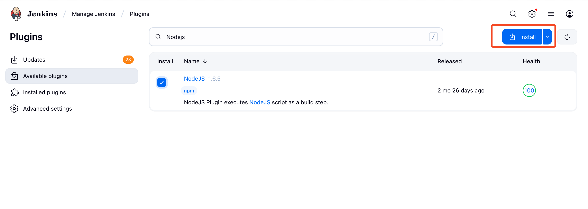
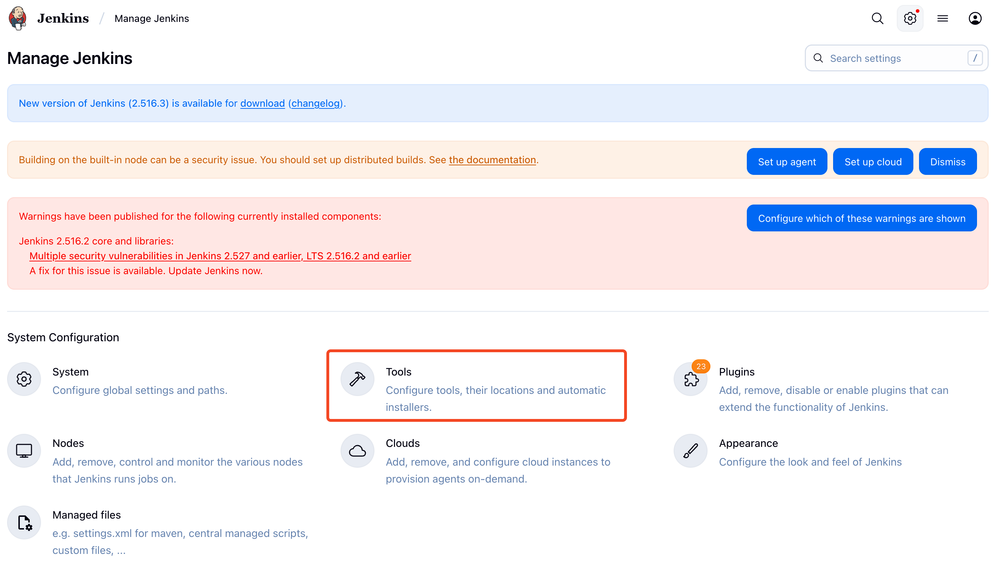
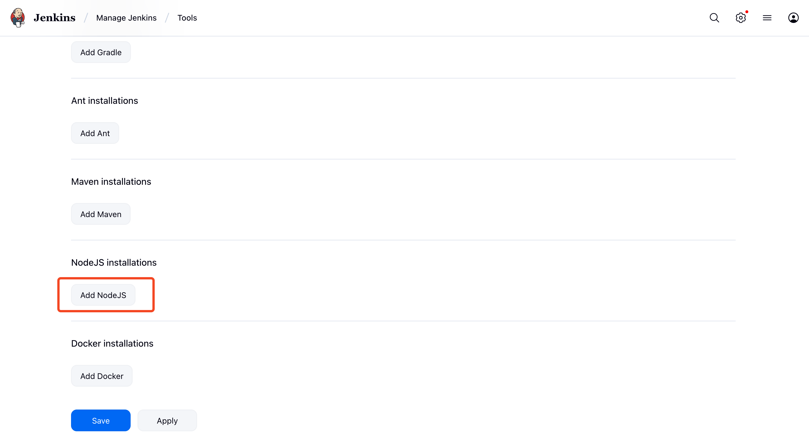
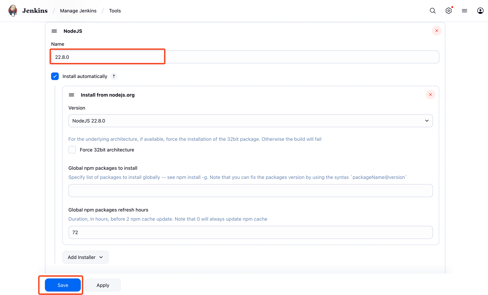

# Jenkins (Pipeline)

<figure><figcaption></figcaption></figure>

Jenkins is the leading open source automation server, Jenkins provides hundreds of plugins to support building, deploying and automating any project.

You can use our [jenkins](https://plugins.jenkins.io/tacotruck-plugin) plugin in your pipeline script.

### &#x20;Jenkins Installation with Docker

1. Create a bridge network in Docker

```sh
docker network create jenkins
```

2. Run a `docker:dind` Docker image

```sh
docker run --name jenkins-blueocean --restart=on-failure --detach \
  --network jenkins --env DOCKER_HOST=tcp://docker:2376 \
  --env DOCKER_CERT_PATH=/certs/client --env DOCKER_TLS_VERIFY=1 \
  --publish 8080:8080 --publish 50000:50000 \
  --volume jenkins-data:/var/jenkins_home \
  --volume jenkins-docker-certs:/certs/client:ro \
  myjenkins-blueocean:2.516.3-1
```

3. Create a Dockerfile

```sh
FROM jenkins/jenkins:2.516.3-jdk21
USER root
RUN apt-get update && apt-get install -y lsb-release ca-certificates curl && \
    install -m 0755 -d /etc/apt/keyrings && \
    curl -fsSL https://download.docker.com/linux/debian/gpg -o /etc/apt/keyrings/docker.asc && \
    chmod a+r /etc/apt/keyrings/docker.asc && \
    echo "deb [arch=$(dpkg --print-architecture) signed-by=/etc/apt/keyrings/docker.asc] \
    https://download.docker.com/linux/debian $(. /etc/os-release && echo \"$VERSION_CODENAME\") stable" \
    | tee /etc/apt/sources.list.d/docker.list > /dev/null && \
    apt-get update && apt-get install -y docker-ce-cli && \
    apt-get clean && rm -rf /var/lib/apt/lists/*
USER jenkins
RUN jenkins-plugin-cli --plugins "blueocean docker-workflow json-path-api"
```

4. Build the docker image from the above Dockerfile and assign a tag such as `myjenkins-blueocean:2.516.3-1`

```sh
docker build -t myjenkins-blueocean:2.516.3-1 .
```

5. Run your image as container

```sh
docker run --name jenkins-blueocean --restart=on-failure --detach \
  --network jenkins --env DOCKER_HOST=tcp://docker:2376 \
  --env DOCKER_CERT_PATH=/certs/client --env DOCKER_TLS_VERIFY=1 \
  --publish 8080:8080 --publish 50000:50000 \
  --volume jenkins-data:/var/jenkins_home \
  --volume jenkins-docker-certs:/certs/client:ro \
  myjenkins-blueocean:2.516.3-1
```

6. Complete the setup [wizard](https://www.jenkins.io/doc/book/installing/docker/#setup-wizard)

### Install Node.js Plugin

Tacotruck plugin requires nodejs as dependency. Login to your jenkins dasboard and go to the settings page. Plugins are available at [http://localhost:8080/manage/pluginManager/available](http://localhost:8080/manage/pluginManager/available) this path. You can search for Nodejs plugin. Select the plugin and install.

<figure><figcaption></figcaption></figure>

### Configure Nodejs as Global Tool

1. Go to settings and click on tools section.

<figure><figcaption></figcaption></figure>

2. Click on "Add Nodejs" button

<figure><figcaption></figcaption></figure>

3. Install a Nodejs version. Please make sure that you install node **version** ≥ <mark style="color:red;">`20`</mark>. You need to name the Tool so that we can refer it later from the pipeline script.

<figure><figcaption></figcaption></figure>

### Install Tacotruck Jenkins Plugin

TODO — This will be replace after jenkins plugin is hosted.

### Tacotruck Pipeline Script

```groovy
pipeline {
    agent any
    tools {
        nodejs '22.8.0'
    }
    stages {
        stage('Build') {
            steps {
                echo 'Building ..'
            }
        }
        stage('Test') {
            steps {
                echo 'Running Test ..'
            }
        }
        stage('Submit Test Results') {
            steps {
                tacotruck(
                    provider: 'testfiesta',
                    runName: 'My TacoTruck Run',
                    apiUrl: 'https://staging.api.testfiesta.com',
                    handle: 'TestHandle',
                    project: 'testProjectKey',
                    credentialsId: 'YOUR_CREDENTIALS_ID',
                    resultsPath: './test-results.xml'
                )
            }
        }
    }
}
```

You can see the documentation for Tacotruck jenkins plugin [here](https://docs.testfiesta.com/). For `credentialsId`  parameter you can see the documentation for using credentials in jenkins [here](https://www.jenkins.io/doc/book/using/using-credentials/).
