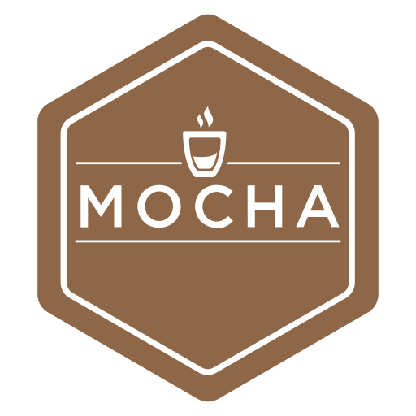

---
layout:
  width: default
  title:
    visible: true
  description:
    visible: true
  tableOfContents:
    visible: true
  outline:
    visible: true
  pagination:
    visible: true
  metadata:
    visible: true
---

# Mocha

<figure><figcaption></figcaption></figure>

Mocha is a feature-rich JavaScript test framework running on [Node.js](https://nodejs.org/) and in the browser, making asynchronous testing _simple_ and _fun_. Mocha can generate standard format JUnit-style XML files which can be submited to Testfiesta or Testrail using taco truck cli. You just need to install the popular [`Mocha`](https://mochajs.org/#installation) and install tacotruck cli or use [Github action](https://github.com/testfiesta/tacotruck-action). Check out simple mocha [example](https://github.com/testfiesta/tacotruck-examples/tree/main/demo-mocha-tf).

### Install Tacotruck CLI


```sh
$ npm install -g @testfiesta/tacotruck
```


### Submit test results



```sh
tacotruck testfiesta \
  run:submit \
  --token testfiesta_... \
  --handle orgHandle \
  --key projectKey \
  --name runName \
  --data results-path/*.xml
```



### Support and Resources

* [TacoTruck Examples](https://github.com/testfiesta/tacotruck-examples)
* [Mocha Docs](https://mochajs.org/next)
* [Tacotruck Issues](https://github.com/testfiesta/tacotruck/issues)
* [**CLI Reference**](../../tacotruck-cli/)
* [Tacotruck Github Action](https://github.com/testfiesta/tacotruck-action)
