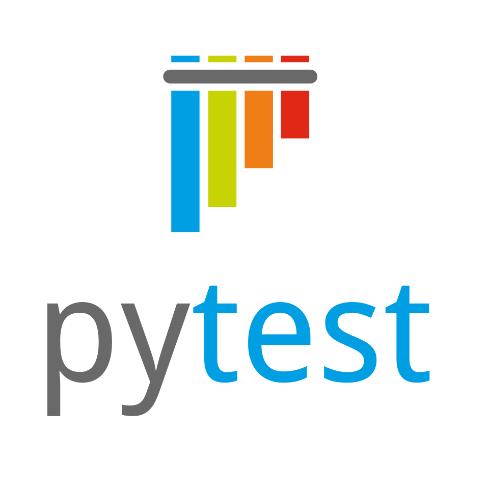

---
layout:
  width: default
  title:
    visible: true
  description:
    visible: true
  tableOfContents:
    visible: true
  outline:
    visible: true
  pagination:
    visible: true
  metadata:
    visible: true
---

# Pytest


<figure><figcaption></figcaption></figure>

The `pytest` framework makes it easy to write small, readable tests, and can scale to support complex functional testing for applications and libraries. pytest unit  can  generate standard format JUnit-style XML files  which can be  submited  to Testfiesta or Testrail using taco truck cli. You just need to install the popular [`pytest`](https://docs.pytest.org/en/stable/getting-started.html) , and install tacotruck  cli or use [Github action](https://github.com/testfiesta/tacotruck-action).  Check simple pytest   [example](https://github.com/testfiesta/tacotruck-examples/tree/main/demo-pytest-tf) &#x20;

**Install tacotruck cli** &#x20;


```javascript
$ npm install -g @testfiesta/tacotruck
$ tacotruck -h
// output
Usage: tacotruck [options] [command]
[...]
```


**Submit test results**



```
tacotruck testfiesta \
  run:submit \
  --token testfiesta_... \
  --handle orgHandle \
  --key projectKey \
  --name runName \
  --data results-path/*.xml
```



```
tacotruck testrail \
  run:submit \
  --url https://<your-org-name>.testrail.io \
  --email username@example.com \
  --password password \
  --name "Test run name" \
  --data results-path/*.xml
```



**Github action**



```json
name: Python Tests
on:
  pull_request:
    branches:
      - main
  push:
    branches:
      - main
jobs:
  test:
    runs-on: ubuntu-latest
    steps:
      - uses: actions/checkout@v4

      - name: 📦 Set up Python
        uses: actions/setup-python@v4
        with:
          python-version: "3.12"

      - name: 📦 Install dependencies
        run: |
          python -m pip install --upgrade pip
          pip install -r requirements.txt

      - name: 🧪 Run tests
        run: |
          pytest --junitxml=test-results.xml

      - name: Upload test results
        uses: actions/upload-artifact@v4
        with:
          name: pytest-results
          path: test-results.xml
        if: always()

      - name: Report Results
        uses: testfiesta/tacotruck-action@v1
        with:
          provider: testfiesta
          handle: handle
          project: project
          run-name: Pytest CI run
          base-url: https://api.testfiesta.com
          credentials: ${{ secrets.TESTFIESTA_API_KEY }}
          results-path: ./test-results.xml
```






