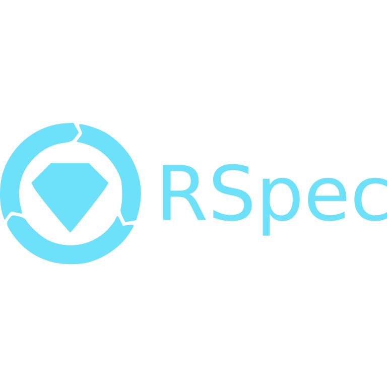

---
layout:
  width: default
  title:
    visible: true
  description:
    visible: true
  tableOfContents:
    visible: true
  outline:
    visible: true
  pagination:
    visible: true
  metadata:
    visible: true
---

# RSpec


<figure><figcaption></figcaption></figure>

RSpec is a behavior-driven development (BDD) testing framework for the Ruby programming language, widely used for testing Ruby code and, notably, Ruby on Rails applications.RSpec  can  generate standard format JUnit-style XML files  which can be  submited  to Testfiesta or Testrail using taco truck cli. You just need to install the popular [`pytest`](https://docs.pytest.org/en/stable/getting-started.html) , and install tacotruck  cli or use [Github action](https://github.com/testfiesta/tacotruck-action).  Check simple RSpec   [example](https://github.com/testfiesta/tacotruck-examples/tree/main/demo-rspec-tf) &#x20;

**Install tacotruck cli** &#x20;


```javascript
$ npm install -g @testfiesta/tacotruck
$ tacotruck -h
// output
Usage: tacotruck [options] [command]
[...]
```


**Submit test results**



```
tacotruck testfiesta \
  run:submit \
  --token testfiesta_... \
  --handle orgHandle \
  --key projectKey \
  --name runName \
  --data results-path/*.xml
```



```
tacotruck testrail \
  run:submit \
  --url https://<your-org-name>.testrail.io \
  --email username@example.com \
  --password password \
  --name "Test run name" \
  --data results-path/*.xml
```



**Github action**



```json
name: ruby rspec

on:
  pull_request:
    branches:
      - main
  push:
    branches:
      - main

jobs:
  test:
    runs-on: ubuntu-latest
    name: Test
    steps:
    - name: Set up Ruby
      uses: ruby/setup-ruby@v1
      with:
        ruby-version: 3.4.5

    - name: Checkout code
      uses: actions/checkout@v4

    - name: Install dependencies
      run: bundle install

    - name: Run tests
      run: bundle exec rspec --format documentation --format RspecJunitFormatter --out spec/test-reports/test-results.xml

    - name: Report Results
      uses: testfiesta/tacotruck-action@v1
      with:
         provider: testfiesta
         handle: handle
         project: project
         base-url: https://api.testfiesta.com
         credentials: ${{ secrets.TESTFIESTA_API_KEY }}
         run-name: Ruby RSpec CI run ${{ github.run_number }}
         results-path: ./spec/test-reports/test-results.xml
```






