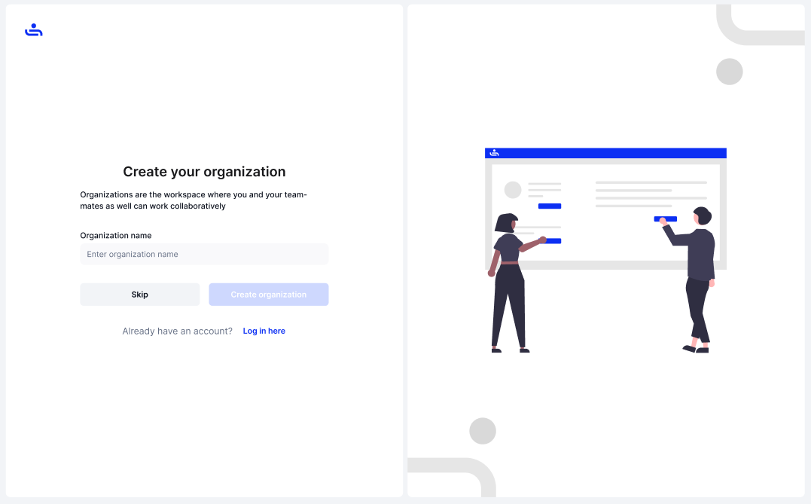

# 🛠️ Create an Account

There are two ways to create an account with TestFiesta. Creating an account by yourself, or joining by Invitation. This page will go over both methods.&#x20;

## Create an Account Yourself

Step 1: Sign Up on our homepage

Visit the [TestFiesta homepage](https://www.testfiesta.com/) and click the "Sign Up" button in the top right corner.

Step 2: Enter Your Details

* **Name:** Enter your first and last name as it will appear in your profile.
*   **Email:**&#x20;

    * Provide a valid email address that will be used as the login for your account

    &#x20;      OR

    * Signup using OAuth through your Google account

Step 3: Agree to Terms

Ensure you read and agree to the Terms of Service and Privacy Policy.

Step 4: Click "Sign Up"

Once all fields are filled out correctly, click the "Sign Up" button.

<figure><figcaption></figcaption></figure>

Step 5: <strong>Email Verification</strong>

You will receive an email to verify your account. Check your inbox (and spam folder) for a verification link.

<figure><figcaption></figcaption></figure>

Step 6: Create password

Create a strong password that meets the required criteria (minimum 8 characters, including a mix of letters, numbers, and symbols).

<figure><figcaption></figcaption></figure>

Step 7: Create your organization (Optional)  

Enter your organization name and press the "Create Organization" button. You may also skip this step and create an Organization later. To see where and how to create an Organization click [here](../../account-settings/personal-workspace/creating-an-organization/)

<figure><figcaption></figcaption></figure>

Step 8: Set up two factor authentication (Optional) 

You can set up two-factor authentication or you can skip for now.  To see how to set up two-factor authentication click [here](broken-reference)

## Join by Invitation

Step 1: Click invitation link to TestFiesta

When getting an invitation to TestFiesta by an Organization, you'll receive an email with a sign up link (make sure to check your spam folder). Click that link and it will bring you to TestFiesta to complete your registration.&#x20;

Step 2: Enter your email and create your password 

The inviting organization will have filled out some information for you, such as your first name and last name. You will need to enter your email and create password that meets the required criteria (minimum 8 characters, including a mix of letters, numbers, and symbols).

<figure><figcaption></figcaption></figure>

Step 3: Set up two factor authentication (Optional) 

You can set up two-factor authentication or you can skip for now.  To see how to set up two-factor authentication click [here](broken-reference)


If you join TestFiesta through an invitation, you may be required to set up two-factor authentication by your organization


You have your account! Now you can explore TestFiesta's many features.&#x20;

Whenever you come back to TestFiesta you can easily Log in with your email and password, which we will show you on the next page.&#x20;
