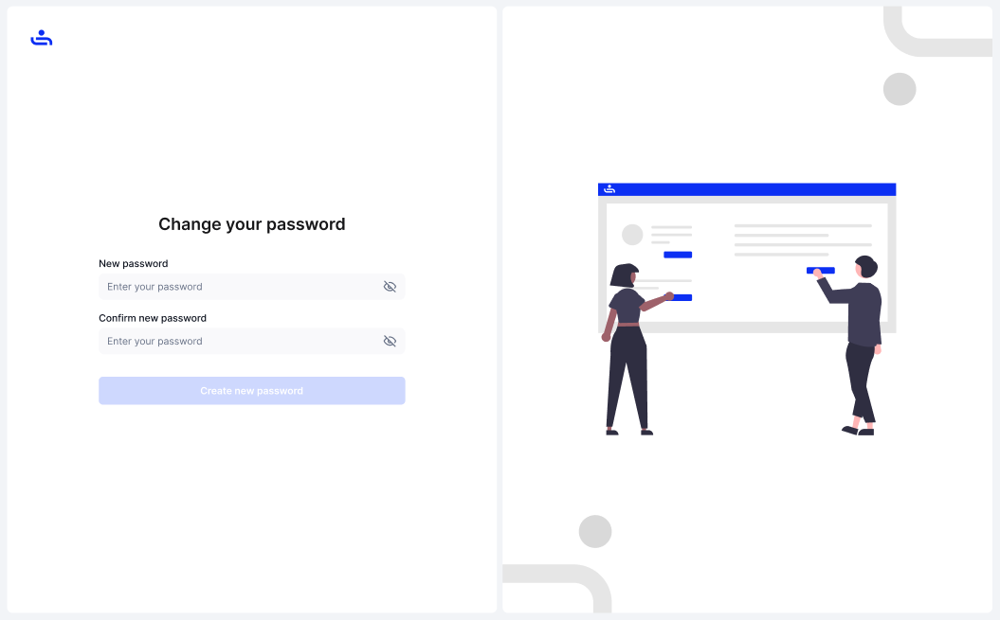

# Reset Password

Step 1: Click "Forgot password?" 

On the log in screen, click "Forgot password?" to begin the reset process

<figure><figcaption></figcaption></figure>

Step 2: Enter your email

Enter the email associated with your TestFiesta account into the password recovery page.

<figure><figcaption></figcaption></figure>

Step 3: Check your email for the recovery link

Check your email (and spam folder) for the recovery instructions and link. If you did not get an email, you can press the "Resend it" button to send another recovery link.&#x20;

Step 4:  Change your password

After following the link in the recovery email, you may now change your password. Once you have chosen a new password, click the "create new password" button.&#x20;

<figure><figcaption></figcaption></figure>

Step 5: Log in with your new password

Now that you have a new password, go back to the log in screen and enter your email and new password.&#x20;

You now have access to your account once again.&#x20;

Now that you can create your account and recover it, you will be able to explore all of TestFiesta's many tabs. on the upcoming page, we will give you an overview of each tab and links to learn more. Click "Next."
