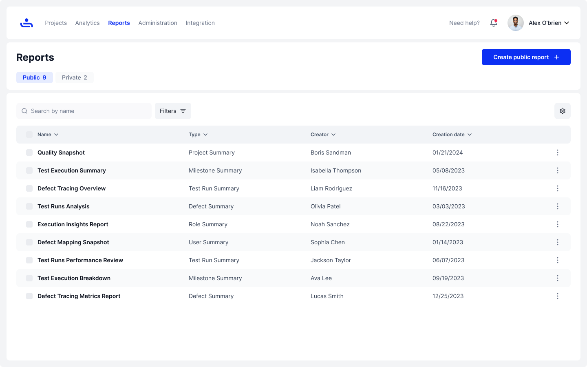
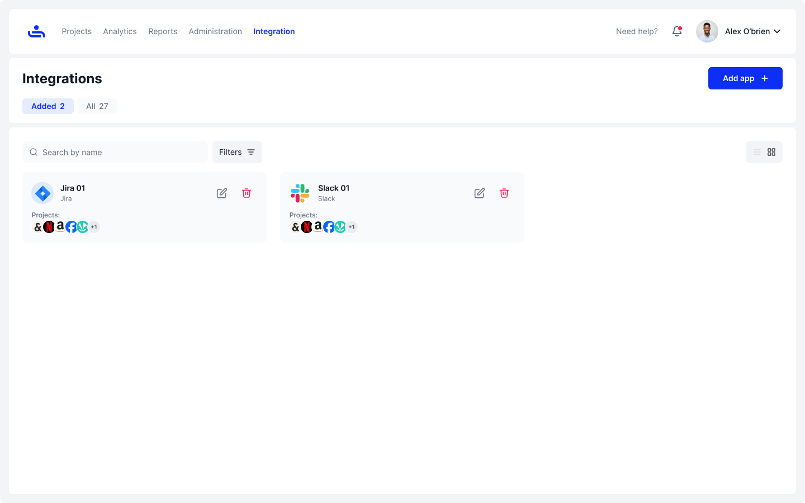

# 📋 Tab Overview

## Projects Tab

The Projects tab is where you will create new projects, add other users, and plan your QA schedule. Within each project there are several sub-tabs including:

* Project Dashboard&#x20;
* Milestones&#x20;
* Test Plans
* Test Runs
* Test Cases
* and Defects

<figure><figcaption></figcaption></figure> <figure><figcaption></figcaption></figure>

We have a comprehensive guide on how to navigate and use the projects tab and the sub-tabs within. To skip to that section and begin learning about Projects, click the link below.&#x20;


[Broken link](broken-reference)


## Analytics Tab

This tab is where you will track your progress, chart your project statistics, and keep updated on user workload. This section too has sub-tabs that include:&#x20;

* Projects
* Roles&#x20;
* and Users

<figure><figcaption></figcaption></figure>

We will explore how to use Analytics to support your TestFiesta activities later on. If you want to skip to that section now, click the link below.&#x20;


[Broken link](broken-reference)


## Reports Tab

Using this tab you can generate reports from one or more projects within different timeframes to share with others. This tab only has two sub-tabs:&#x20;

* Public&#x20;
* Private

<figure><figcaption></figcaption></figure>

Each tab stores your created reports. To learn to how create, filter, schedule, and send a report, click the link below.&#x20;


[Broken link](broken-reference)


## Administration Tab&#x20;

Here is where you will manage your Organizations and be able to view/edit your Organization Users, Tags, Roles, and Repository. This tab also has several sub-tabs:&#x20;

* Users
* Roles
* Tags
* Configurations
* Templates
* Custom Fields
* and Shared Steps

<figure><figcaption></figcaption></figure>

To learn what all of these terms mean and how to begin using them, click on the link below.&#x20;


[Broken link](broken-reference)


## Integration Tab

Did you want to use other app information with TestFiesta? This tab allows you to integrate multiple applications to fit your needs.&#x20;

<figure><figcaption></figcaption></figure>

To learn which apps are available to integrate and how to add them, click on the link below.&#x20;


[Broken link](broken-reference)


## Account Settings

Here you will be able to manage your setting for both your personal account and organization (depending on your permissions). These areas also have multiple sub-tabs, some of which can only be accessed in personal or Organization settings:&#x20;

* Account
* Organizations
* API Keys
* Notifications
* Authentication
* Audit Log
* Billing
* Data Colors
* About

<figure><figcaption></figcaption></figure>

To learn what each sub-tab means and how to use them, click the link below.&#x20;


[Broken link](broken-reference)


Now that you’re familiar with the tabs overview, it’s time to dive into organizing your tests. Click "Next" to get started!
