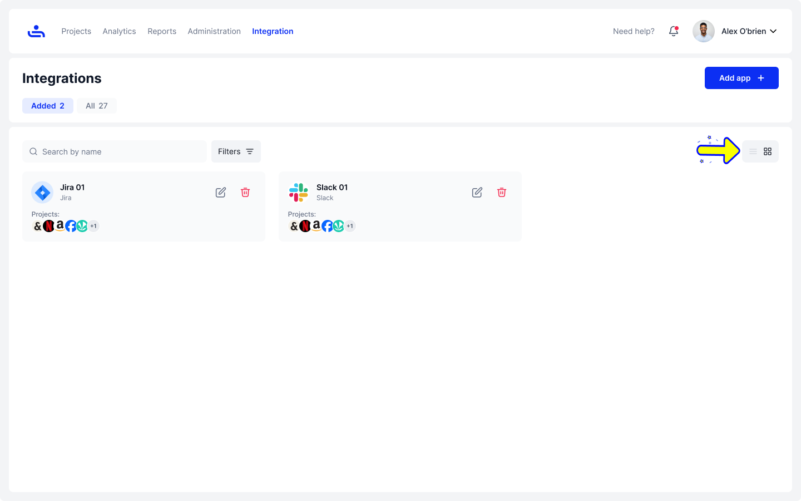
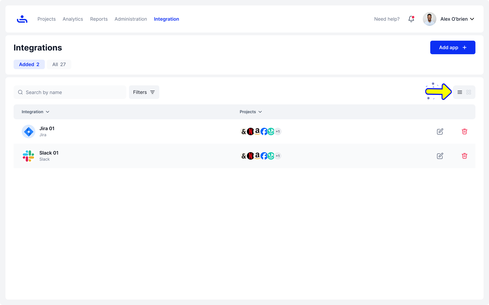

# Tab and Table view

To change views, click on the Tab or Table icons on the right of the screen. The image below is the Added tab in Tab view

<figure><figcaption></figcaption></figure>

This is the Added tab in Table view&#x20;

<figure><figcaption></figcaption></figure>

This is the All tab in the Tab view&#x20;

<figure><figcaption></figcaption></figure>

And this is the All tab in the Table view&#x20;

<figure><figcaption></figcaption></figure>

Now that you know what the Integrations home page looks like and how to navigate it, we can move on to Adding Integrations on the next page. Click "Next."&#x20;
