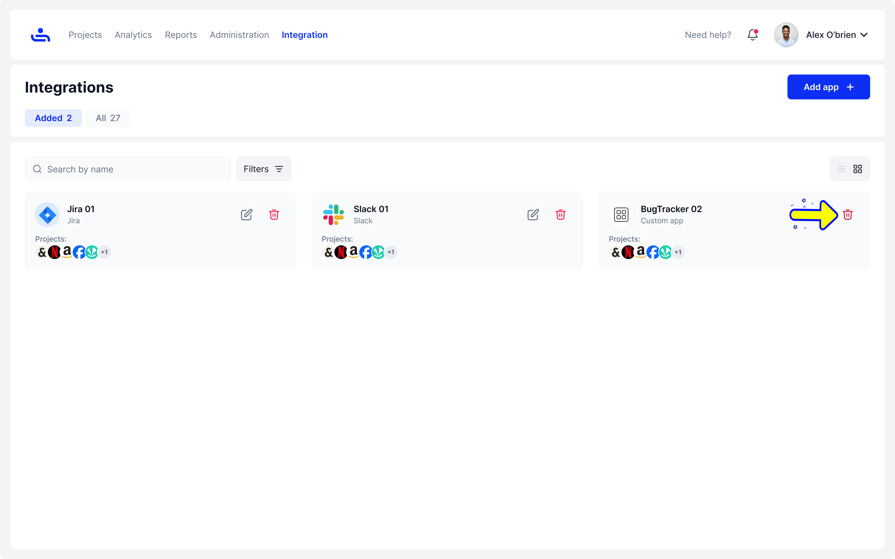

# Deleting Integrations

Step 1: Click the trash icon on your Integration

Click the Trash icon on the right side on the Integration you want to delete and confirm the deletion.&#x20;

<figure><figcaption></figcaption></figure>

<figure><figcaption></figcaption></figure>

<figure><figcaption></figcaption></figure>


All data from the integration will be lost upon deletion.&#x20;


That's it! You now know how to delete an integration. You should also know how to navigate the integrations tab, add, edit, and apply integrations to your projects. The next section will address Account Settings. &#x20;
