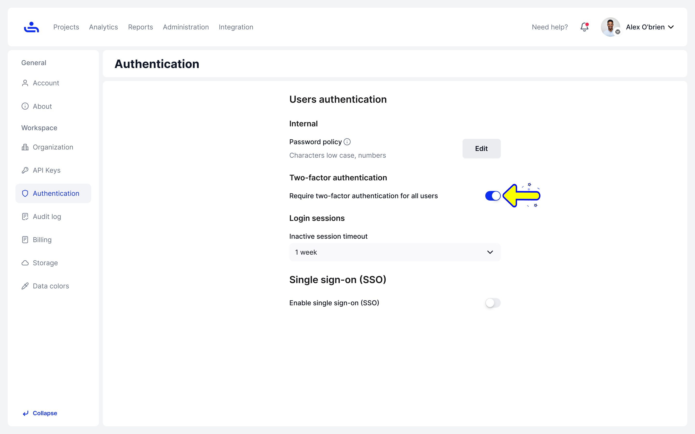

# Two-Factor Authentication (2FA)

Two-factor authentication requires users to have a second form of confirming their identity on top of their login password. This helps to keep user accounts secure. TestFiesta has two methods of using two-factor authentication: A text message or an authentication app. To see how to set up two-factor authentication for your account click [here](../../account-settings/general-settings/security/two-factor-authentication-2fa/).

You may enable two-factor authentication for your Organization, meaning all users who are invited to your Organization will be required to set up two-factor authentication for their account.

Enable two-factor authentication for your Organization by clicking the slider shown in the image below

<figure><figcaption></figcaption></figure>

As an added layer of security, you can require your Organization members to log in again after a specified time of being inactive. To learn more about the timeout feature, click "Next."
