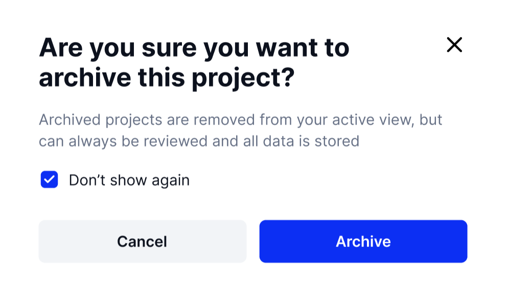
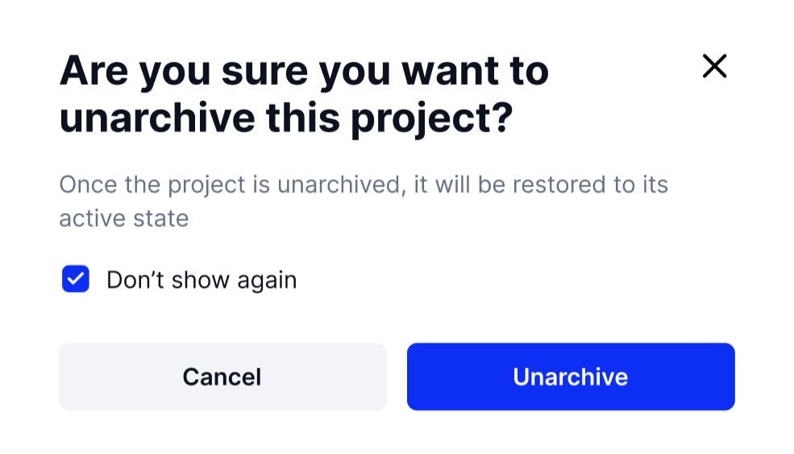

# Editing, Deleting, & Archiving Projects

Deleting a Project vs Archiving it

Deleting a Project will remove it from Active and Archived views on the Project Lists page. All data associated with a deleted Project will be removed & a deleted Project can only be recovered by an Administrator via the [Audit Log](../../../organization-owner-workspace/audit-log.md).

<figure><figcaption>
A deleted Project can only be recovered by an Administrator via the <a href="../../../organization-owner-workspace/audit-log.md">Audit Log</a>.
</figcaption></figure>

How to change Project status

Click on the kebab icon next to a Project, then select "Archive" or "Unarchive" to change the Project status. You will receive a notification confirming your choice and the option to proceed or cancel the request.

<figure><figcaption>
Notification given when Archiving a Project.
</figcaption></figure> <figure><figcaption>
Notification given when Unarchiving a Project.
</figcaption></figure>

How to delete a Project

Click on the kebab menu on a Project, and next, select the "Delete" option. A notification will appear asking if you wish to continue or cancel the deletion request.

<figure><figcaption>
Click the kebob icon next to the project you want to remove and click "Delete".
</figcaption></figure>

<figure><figcaption>
A notification will appear when you try to delete a Project.
</figcaption></figure>


Note that a deleted Project can only be recovered by an Administrator via the [Audit Log](../../../organization-owner-workspace/audit-log.md).


Editing Project Name

Click on the pencil icon next to the Project name. From here you can change the Project name as well as the description for it.

<figure><figcaption>
When editing Project information click on the pencil icon to change the name and description.
</figcaption></figure>

Need to add more users to your Project? The next page will show you how to use the edit Project function. Click "Next"
