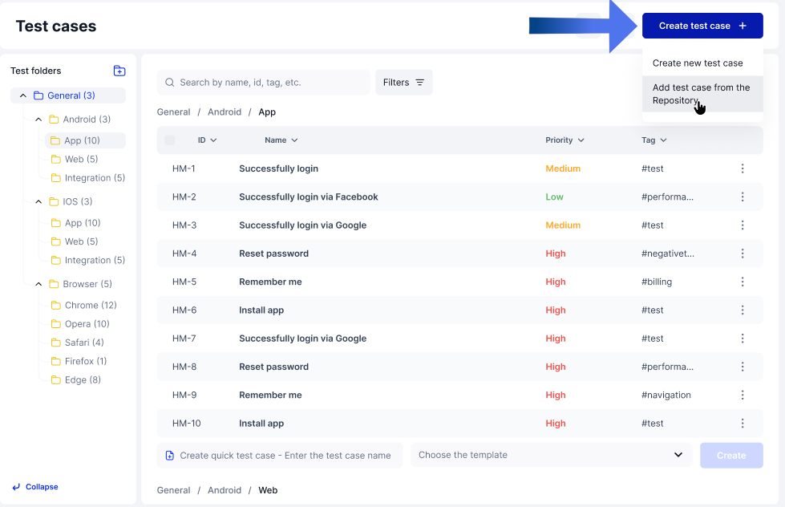
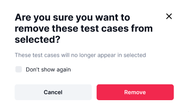
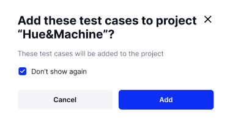

# Adding Test Cases From a Repository

Step 1: Click "Create test case" and choose "Add test case from the repository" 

On the top right of the Test Cases home page, click "Create test case" and choose "Add test case from the repository." This will take you to your repository page.&#x20;

<figure><figcaption></figcaption></figure>

Step 2: Select Test Cases from repository and click "Add" 

Select as many Test Cases as you require from the repository and then Click add at the bottom right of the screen. This will place copies of these Test Cases in the "Selected" tab&#x20;

<figure><figcaption></figcaption></figure>

Step 3: In the "Selected" tab, choose to remove Selected Test Cases or proceed to step 4

You may choose to remove your selected Test Cases before adding them to your project by selecting them on this page and clicking "Remove" on the bottom right of the screen. A confirmation menu will popup. Click "Remove" and those Test Cases will be removed from your Selected group.&#x20;

<figure><figcaption></figcaption></figure> <figure><figcaption></figcaption></figure>

Step 4: In the "Selected" tab, click "Add to the Project" 

Once you are sure of your Test Case selection, click "Add to the project" and confirm to add all selected repository Test Cases to your project.&#x20;

<figure><figcaption></figcaption></figure> <figure><figcaption></figcaption></figure>

And that's it! You should be able to navigate and use the Test Cases now. The next page will begin with an explanation of the Defects Tab. &#x20;
