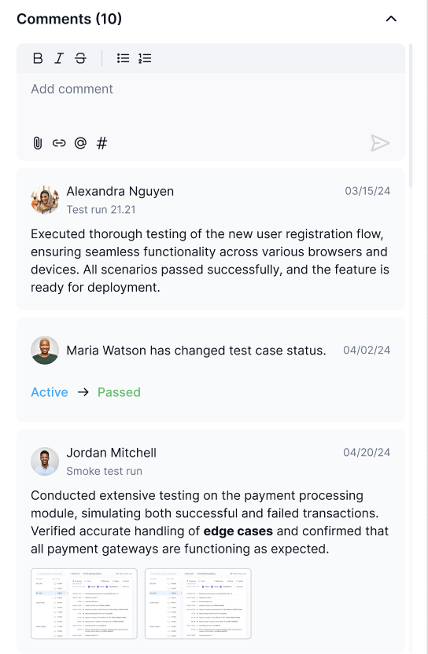

# Test Case Anatomy

So what is a Test Case? A Test Case is how users will plan out feature testing by deciding what tests they want to run, the priority, and a description of the tests. Test Cases also allow teams to track their testing progress and report any defects they find.

Templates

TestFiesta Templates provide the user with standardized types of Test Cases for different intended objectives. Default Templates include Text, Steps, Exploratory session, and Behavior Driven Development. If you wish to create your own template, a custom option is also available. To learn more about Test Case Template styles click [here](test-case-anatomy.md#templates)

<figure><figcaption></figcaption></figure> <figure><figcaption></figcaption></figure>

Priority

The Priority field allows you to set the urgency or importance of each individual Test Case. Priority levels range from low, medium or high.&#x20;

<figure><figcaption></figcaption></figure> <figure><figcaption></figcaption></figure>

Creator 

The Creator is the user who initially created the Test Case. The Test Case Creator is visible when viewing the expanded Test Case details.&#x20;

<figure><figcaption></figcaption></figure>

ID

An ID is automatically assigned to each Test Case when it is created.&#x20;

The first Test Case created in a Test Suite will be assigned the ID HM-1, while each subsequent Test Case in the same Test Folder will numerically increase by one (HM-2, HM-3).&#x20;

You can overwrite the ID using your own preferred methodology as long as all IDs are unique.

<figure><figcaption></figcaption></figure> <figure><figcaption></figcaption></figure>

Last Update

This field shows the last day the Test Case was edited.

<figure><figcaption></figcaption></figure>

Tags

You can assign custom Tags to Test Cases and sort them into groups based on the needs of your Project and Organization.&#x20;

Our examples includes tags such as #performance #test or #billing to give you a few idea on how tags can be used&#x20;

<figure><figcaption></figcaption></figure>

Assigned To

Within a given Test Run, Test Cases can be assigned to a tester who is responsible for completing that test. If the Test Case has been assigned to someone, that user will appear here.&#x20;

<figure><figcaption></figcaption></figure>

Attachments

Users can add attachments to a Test Case when creating, editing or commenting.&#x20;

These attachments are typically evidence that a Test Case was completed or are details to help developers identify and recreate any defects that were found.

<figure><figcaption></figcaption></figure> <figure><figcaption></figcaption></figure>

Description

Typically used to describe the goals for the Test Case or specific steps a tester should take and the results that are expected from the test.&#x20;

<figure><figcaption></figcaption></figure>

Comments

To improve collaboration efforts users have the ability to add comments to a Test Case. Comments allow users to @ other teammates, provide a link , make attachments, and reference tags using the # symbol&#x20;

<figure><figcaption></figcaption></figure>

Test Runs

Records of how this Test Case performed during past Test Runs are listed here, including whether the test was passed, failed, or incomplete.&#x20;

This can be especially helpful in identifying flaky tests that may need to be reworked.

<figure><figcaption></figcaption></figure>

Defects

Defects encountered during Test Runs are recorded here. If you need to unlink a Defect you can find instructions here.

<figure><figcaption></figcaption></figure>

Now that we have covered the major components of a Test Case, we can go into Creating New Test Cases. Click "Next"
