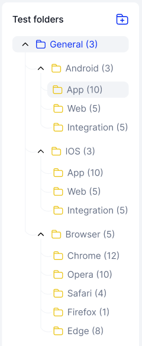

# Test Folders

## Creating Test Folders

Step 1: Navigate to the Test Cases Tab in the Projects section. &#x20;

<figure><figcaption></figcaption></figure>

Step 2: Click "Create test folder"

<figure><figcaption></figcaption></figure>

Step 3: Name your Test Folder and press "Enter"&#x20;

<figure><figcaption></figcaption></figure>

You can change the Test Folder name at anytime by double clicking the current name, writing a new name, and pressing enter.&#x20;

Your Test Folder is now created! This example Folder is for "Android" and would hold any Test Cases related to Android OS. Users can make as many Test Folders as is necessary to sort their Test Cases. The image below shows an example of a full set of Test Folders.

<figure><figcaption></figcaption></figure>

## Deleting Test Folders

You can delete created Test Folders whenever you want by following these steps:&#x20;

Step 1: Double click on Test Folder name&#x20;

<figure><figcaption></figcaption></figure>

Step 2: Click the Trash Icon that appears and confirm&#x20;


This will delete your Test Folder, all Test Folders held within, and all Test Cases in those folders.&#x20;


<figure><figcaption></figcaption></figure> <figure><figcaption></figcaption></figure>

You Test Folder should now be deleted.&#x20;

Now that you know how to create, sort and delete Test Folders, you will need to create Test Cases. But first, let's learn what a Test Case is. Click "Next" to learn the anatomy of a Test Case
