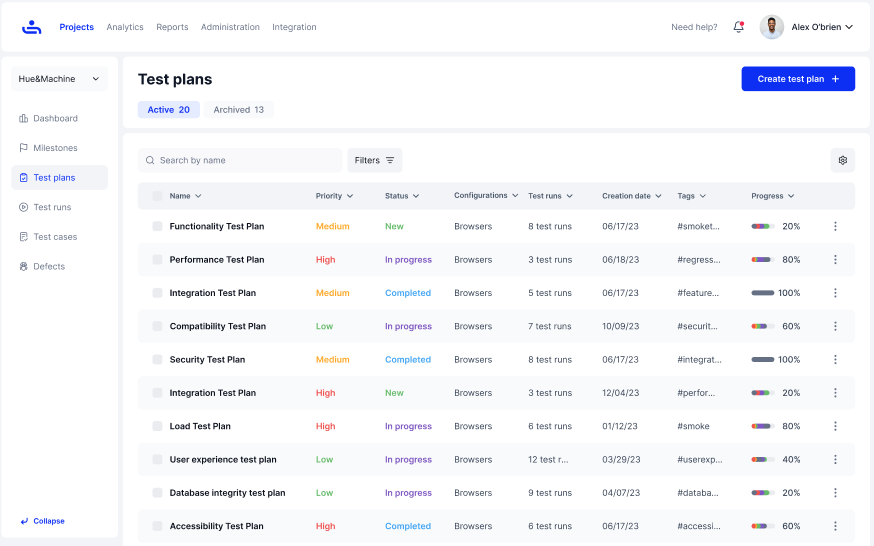
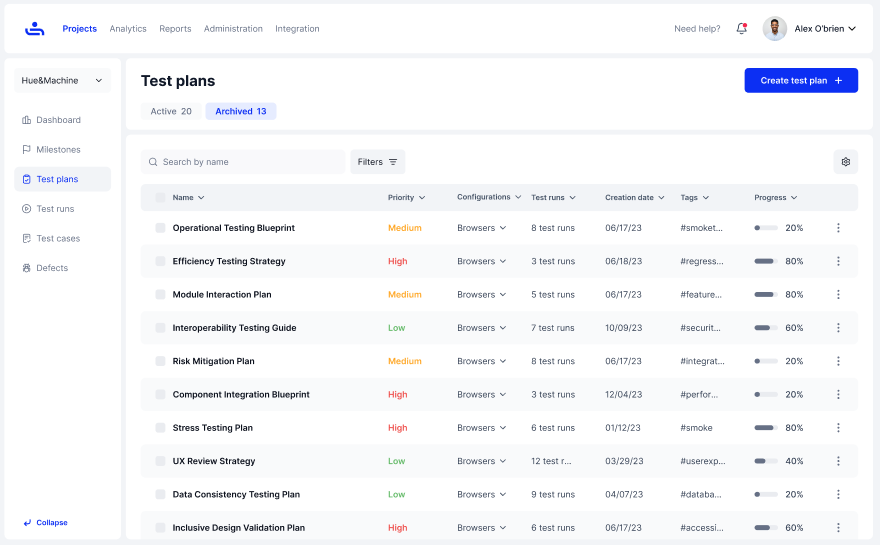

# Active & Archived Tabs

## Active Test Plans

Test Plans in this tab still have ongoing testing to do and can be edited, archived, deleted, and added to another milestone.&#x20;

<figure><figcaption></figcaption></figure>

## Archived Test Plans

Once a Test Plan has reached the end of testing, or you no longer have a need for it, you can archive it to save all relevant data recorded. You cannot edit archived Test Plans or add them to milestones until they are Unarchived. &#x20;

<figure><figcaption></figcaption></figure>
