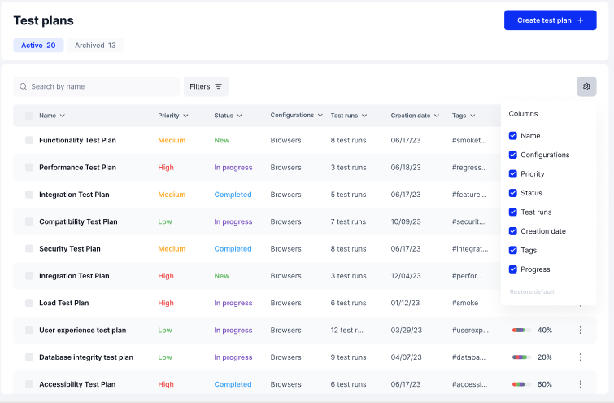

# Table View and Changing Columns

## Columns&#x20;

By default, the columns for Test Plans include the Name, Configurations, Priority, Status, Test runs, Creation date, Tags, and Progress. Each column can be added or removed as required.&#x20;

## Editing Columns

Step 1: Click the Cog wheel icon 

This will open up the list of columns options and checkboxes

<figure><figcaption></figcaption></figure>

Step 2:  Choose from Column options 

You can add or remove any column by checking or unchecking each checkbox beside the options. The chosen options will appear on the table view.&#x20;

<figure><figcaption></figcaption></figure>

You can also filter your Test Plan list to find the specific one you need at any given time. Click "Next" to find out how.&#x20;
