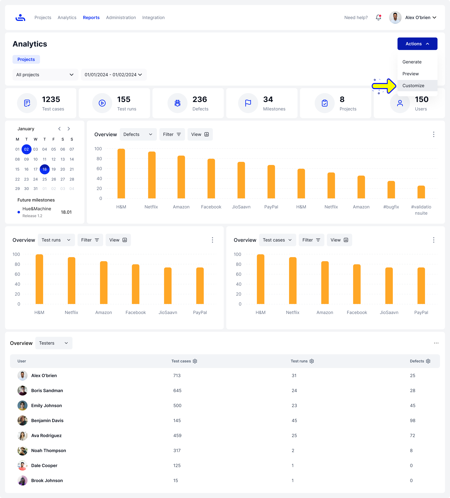
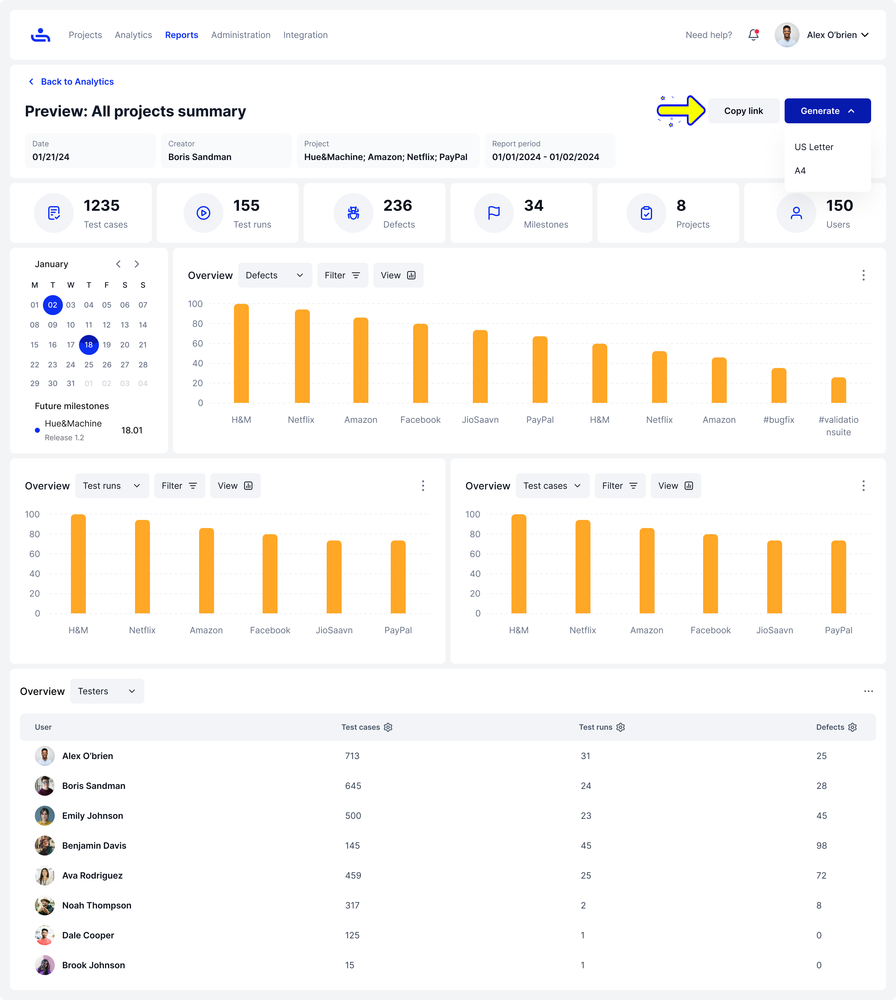

# All Projects Summary

## Creating an All Projects Summary Report.

Step 1: Set up Report options and generate the Report

Select "All Projects Summary" in the drop-down menu for type on the Reports page. Then fill in the rest of the field with the appropriate information and click the "Generate" button on the bottom right of the page. You will then be taken to the analytics page.

<figure><figcaption>
When creating a report, select "All Projects Summary" from the drop-down menu.
</figcaption></figure>

Step 2:  Examine the Report in the Analytics section

On the analytics page, You can do the following from the "Actions" button menu on the top right:

* Generate the Report
* Preview the Report&#x20;
* Customize the Report

<figure><figcaption>
On the Analytics Page click the "Actions" Button and select "Customize".
</figcaption></figure>

Customize

Allows you to enter the charts library to add charts and information based on what you need to display on the report.

<figure><figcaption>
Add charts to your report based on the information needed.
</figcaption></figure>

Preview

You can preview the Report information, & also have a view of any customized additions to the Report that you have added.

<figure><figcaption>
Review what you have added to your Report before moving on.
</figcaption></figure>

Step 3: Generate the Report

Click on the generate button to generate the Report, you can format it in US Letter or A4 PDF formats.\
\
You can also click "Copy Link to copy the Report link to send to other users. &#x20;

<figure><figcaption>
Copy link, generate your report in US Letter, or A4 PDF formats to share with your team. 
</figcaption></figure>

Now that we have the All Project Summary reports handled, let's get more granular with the project summary report! Click "Next" to continue.
