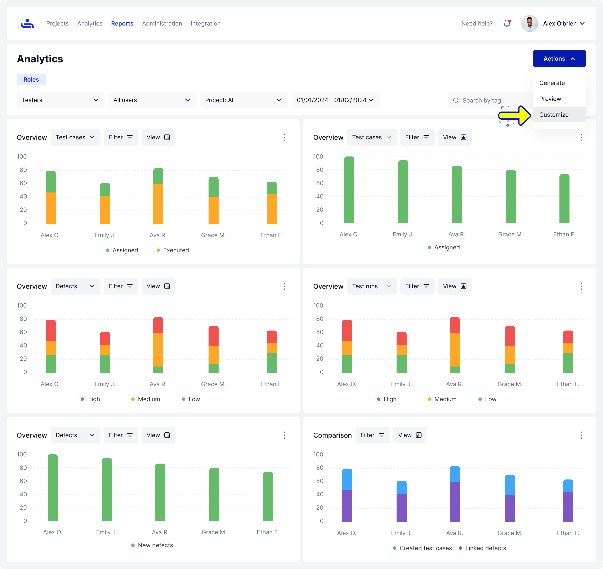
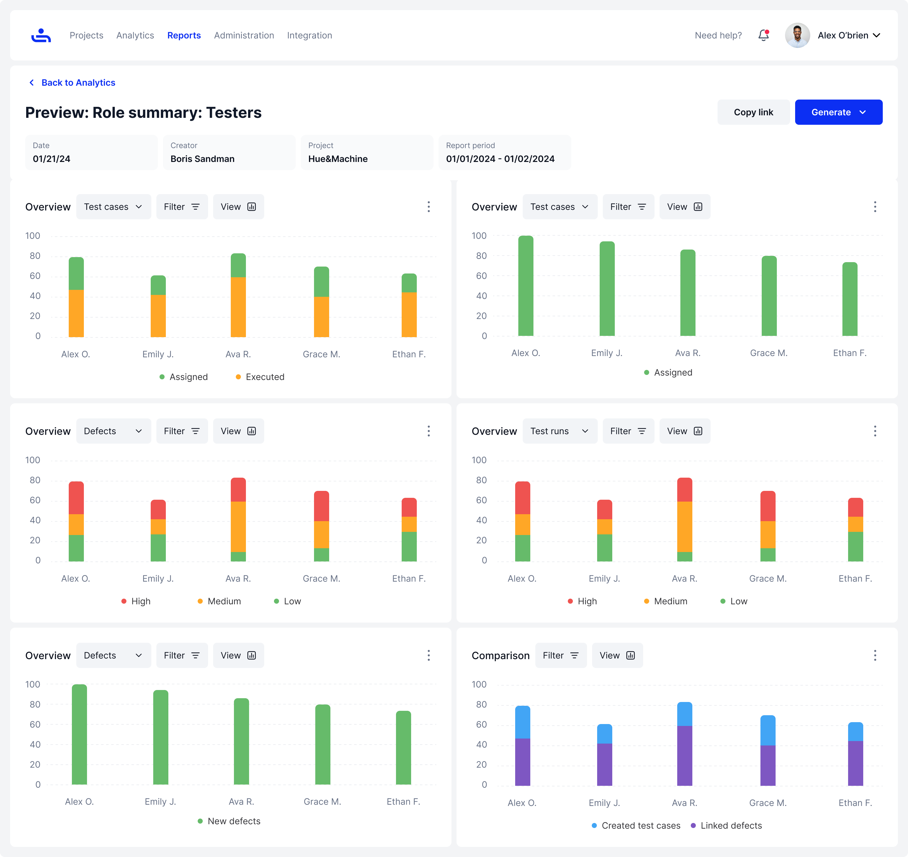
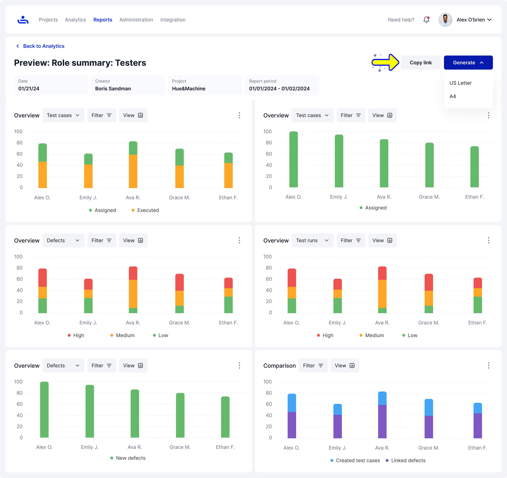

# Role Summary

## Creating a Role Summary Report&#x20;

Step 1: Set up Report options and generate the Report

Select "All Projects Summary" in the drop-down menu for type on the Reports page. Then fill in the rest of the field with the appropriate information and click the "Generate" button on the bottom right of the page. You will then be taken to the Analytics page.

<figure><figcaption>
Select "Role Summary" from the drop-down menu when creating a new report. Then click "Generate" on the bottom right.
</figcaption></figure>

Step 2:  Examine the report in the Analytics section

On the analytics page, you can do the following from the "Actions" button menu on the top right:

* Generate the Report
* Preview the Report&#x20;
* Customize the Report&#x20;

<figure><figcaption>
Examine the report, and then click on the "Actions" button and select "Customize" to add charts to your report.
</figcaption></figure>

Customize

Allows you to enter the charts library to add charts and information based on what you need to display on the Report.

<figure><figcaption>
Choose from the available charts to add to your Report. 
</figcaption></figure>

Preview

You can preview the Report information, & also have a view of any customized additions to the Report that you have added.

<figure><figcaption>
Preview the Report to make sure everything is set.
</figcaption></figure>

Step 3: Generate the Report

Click on the generate button to generate the Report, you can format it in US Letter or A4 PDF formats.\
\
You can also click "Copy Link" to copy the Report link to send to other users. &#x20;

<figure><figcaption>
You can copy the Report link to easily share the Report to your team. If you wish to generate the report, you can choose from US Letter or A4 PDF formats. 
</figcaption></figure>

Role Summary Reports help get a visual on how your team is operating. But to get even more in-depth with how your team is doing on a Project, we need to generate a User Summary Report. To begin, click "Next" to continue.
